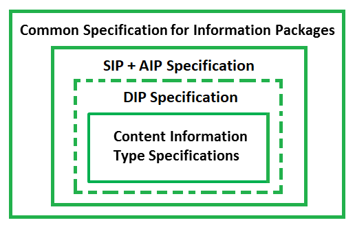

# 1. Introduction

## 1.1. Scope and purpose

Key objectives of this specification are:

- To define a generic structure of the DIP format in a way that it is suitable for a wide variety of archival records, such as document and image collections, databases or geographical data.
- To recommend a set of metadata related to the structural and the access aspects of the DIP as implemented by the reference implementation.

This document is a DIP specification which is guided by the following model (see Figure 1):

_Common Specification for Information Packages_

Common Specification for Information Packages (CSIP) identifies and standardises the common aspects of information packages (SIP/AIP/DIP) which are equally relevant and implemented by any of the functional entities of the overall digital preservation process (i.e. pre-ingest, ingest, long-term preservation and access). 
CSIP is a separate document. Therefore, the current specification does not aim largely repeating the information presented there – only the information that is absolutely necessary to understand the DIP specification will be mentioned here. 

_SIP, AIP, and DIP Specification_

SIP, AIP, and DIP specifications are in some respects outlined to be "on the same level" in the hierarchical order of specifications,
but there are some cases where the DIP specification heavily relies on what is stated in the SIP and AIP specifications.
This is the current document which describes the DIP package structure and minimum set of required metadata for DIP creation.

_Content Information Type Specifications_

Content Information Type Specificationsare content-dependent specifications which include detailed information on how content, metadata, and documentation for specific content types (for example ERMS or relational databases) can to be handled within the SIP. At the moment, there are 2 such specifications:
	- SMURF ERMS for electronic records management systems (The SMURF profile for ERMS can be found https://github.com/DLMArchivalStandardsBoard/SMURF/tree/master/spec.) 
	- SMURF SFSB for simple file system based records (The SMURF profile for SFSB can be found at https://github.com/DLMArchivalStandardsBoard/SMURF/tree/master/spec.) 

## 1.2 Definition of a DIP
The definition of an CS DIP is that it corresponds to an CS IP which is ready to be processed by its designated Access Software; if it is not suited for processing and rendering by its designated Access Software, it is not (yet) a DIP. 
This is a very generic, but handy, definition. To be more specific, the CS DIP is: 

- an IP which is sent (or is ready to be sent) to the user in an Access environment; 
- supported by E-ARK tools, i.e. can be rendered by bespoke Access Software.

The DIP is to a very large extent similar to the AIP from which it is created. However, there are also significant differences.

First of all, the DIP looks like the AIP: It replicates the structure of the AIP from which it is derived. It also inherits all the metadata as well as the intellectual entities of the AIP, regardless of any format migrations that may have occurred during the AIP-DIP conversion process.
Secondly, the DIP is different from the AIP: The DIP allows for example for the inclusion of new DIP representation formats, which are more user-friendly than the AIP formats that are intended for long-term preservation purposes. It also allows for the updating of the metadata as well as for the addition of new metadata elements. Representation Information, which is required for rendering and understanding the intellectual content, is also added, and as a direct consequence, there may be a need for new folders and files, for example within the ‘Documentation’ folder.

