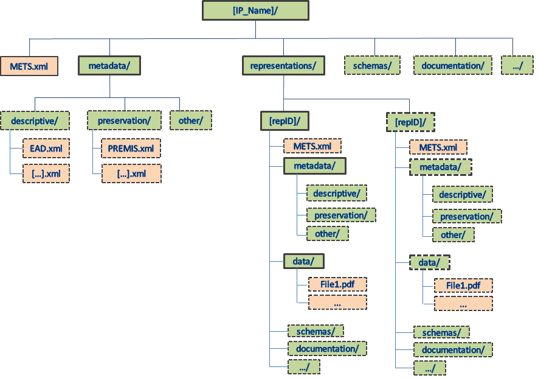

# 1. Introduction

## 1.1 Scope and purpose

Key objectives of this E-ARK DIP specification are:

- To define a generic structure of the DIP format in a way that it is suitable for a wide variety of archival records, such as document and image collections, databases or geographical data.
- To recommend a set of metadata related to the structural and the access aspects of the DIP as implemented by the reference implementation.

## 1.2 Relations to other E-ARK specifications
The E-ARK DIP specification can be found in the following model (see Figure 1):

_Common Specification for Information Packages_

Common Specification for Information Packages (CSIP) identifies and standardises the common aspects of information packages (SIP/AIP/DIP) which are equally relevant and implemented by any of the functional entities of the overall digital preservation process (i.e. pre-ingest, ingest, long-term preservation and access). 
CSIP is a separate document as all the grey boxes are. Therefore, this E-ARK DIP specification does not aim at repeating the information presented there – only the information that is absolutely necessary to understand the DIP specification will be mentioned here. 

_SIP, AIP, and DIP Specification_

SIP, AIP, and DIP specifications are in some respects outlined to be "on the same level" in the hierarchical order of specifications, since they alle need to be compliant to the Common Specification for Information Packages.
But following the OAIS reference model, the above model can also be read from left to right since a DIP is *derived from one or more AIPs*. 
Therefore there are some cases where the DIP specification heavily relies on what is stated in the SIP and AIP specifications. 
Therefore, this E-ARK DIP specification does not aim at repeating the information presented there – only the information that is absolutely necessary to understand the DIP specification will be mentioned here.

_Content Information Type Specifications_

Content Information Type Specifications are content-dependent specifications which include detailed information on how content, metadata, and documentation for specific Content Information Types 
(for example ERMS or relational databases) is to be handled within the SIP, AIP and DIP. It is in these specifications where most implementation issues are dealt with. 

## 1.3 Definition of a DIP

The OAIS reference model defines an DIP as:

*An Information Package, derived from one or more AIPs, and sent by Archives to the Consumer in response to a request to the OAIS.* 

The definition of an E-ARK DIP is that it corresponds to a CS IP which is ready to be processed by its designated Access Software; if it is not suited for processing and rendering by its designated Access Software, it is not (yet) a DIP. 
This is a very generic, but handy, definition. To be more specific, the E-ARK DIP is: 

- an IP which is sent (or is ready to be sent) to the user in an Access environment; 
- supported by E-ARK tools, i.e. can be rendered by Access Software.

First of all, the DIP looks like the AIP: It replicates the structure of the AIP from which it is derived. It also inherits metadata as well as the intellectual entities of the AIP. An E-ARK AIP may therefore also be a E-ARK DIP, 
however in most cases it is necessary to convert from an AIP to a DIP.  The DIP allows for example for the inclusion of new DIP representation formats, which are more user-friendly than the AIP formats that are intended for long-term preservation purposes. 
It also allows for the updating of the metadata as well as for the addition of new metadata elements.  Representation Information, which is required for rendering and understanding the intellectual content, might also be added, and as a direct consequence, there may be a need for new folders and files, for example within the ‘Documentation’ folder.

## 1.4 Structure of a DIP
The folder structure of a CS DIP must comply with the requirements for the folder structure for a CS IP, see [Folder structure of the CS IP](https://dilcisboard.github.io/E-ARK-CSIP/specification/implementation/structure/folders/).

The CS IP folder structure and its requirements is visualised in the figure below:

- Green boxes represent folders
- Red boxes represent files. 
- Boxes with full lines represent mandatory files/folders
- Boxes with dotted lines represent optional files/folders. 

As can be seen from the figure - the requirements for the folder structure for a CS IP is at a bare minimum and makes it possible to have several extra optional folders and files in a CS IP (see boxes with dotted lines). 
The first thing to be said about the E-ARK DIP structure in regard to CS IP structure is that an E-ARK DIP will always consist of some of those files and folders that are optional in the CS IP minimum structure. 
There must be data to dissemenate. Since the definition of an E-ARK DIP is that it corresponds to a CS IP which is ready to be processed by its designated Access Software, this leaves the question as to which data 
in the CS IP should be chosen to be encompassed in the E-ARK DIP. It is possible that an AIP in its current state and in its entirety can be delivered to a Consumer as is and still be considered an E-ARK DIP. 
That E-ARK DIP can contain the submission representation, and one or more preservation representations. Often, however, the OAIS is interested in leaving out irrelevant data and metadata and only present the 
Consumer with the data and metadata that the Consumer is interested in. This could be isolated to the content in one single representation in an E-ARK AIP, or maybe only a portion of a single representation in an E-ARK AIP.     
Maybe down to only one specific file. The point here is that a plethora of different E-ARK DIPs can be created out of an E-ARK AIP or several E-ARK AIPs. 

