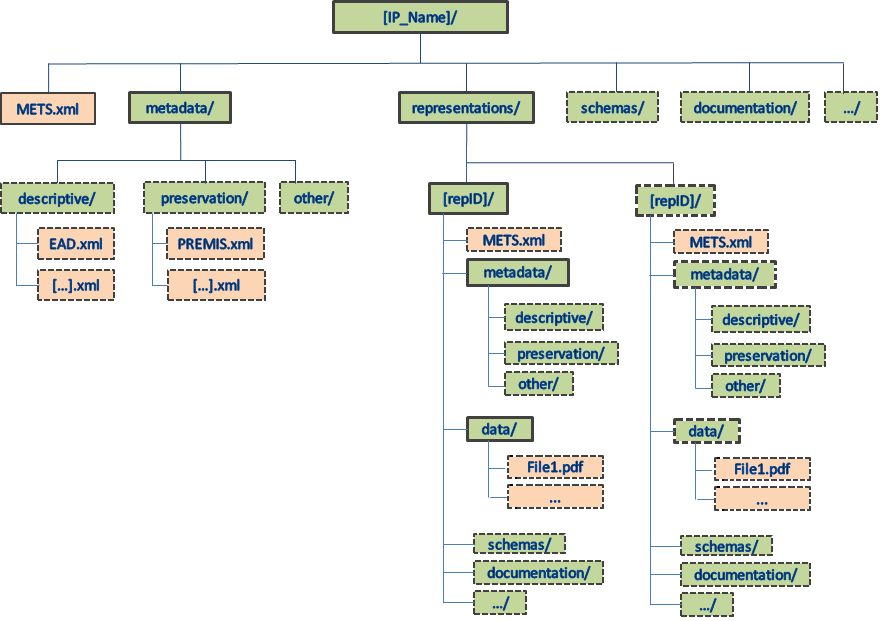

# **​2 Structure and Content Information Types**

## 2.1 Structure
The folder structure of an CS DIP must comply with the requirements for the folder structure for an CS IP, see [Folder structure of the CS IP](https://dilcisboard.github.io/E-ARK-CSIP/specification/implementation/structure/folders/).

The CS IP folder structure and its requirements is visualised in the figure below:

- Green boxes represent folders
- Red boxes represent files. 
- Boxes with full lines represent mandatory files/folders
- Boxes with dotted lines represent optional files/folders. 

As can be seen - the requirements for the folder structure for a CS IP is at a bare minimum and makes it possible to have several extra optional folders in a CS IP (see boxes with dotted lines). 
The first thing to be said about the CSIP structure in regard to CS DIP is that a CS IP can contain one or more representations.
Since the definition of an CS DIP is that it corresponds to an IP which is ready to be processed by its designated Access Software 

DIPSTR1: The data folder MUST include at least one file which can be 

The DIP folder structure can change slightly depending on its Content Information Type. The sections below that deal with the DIP format specifications will reflect these changes.
