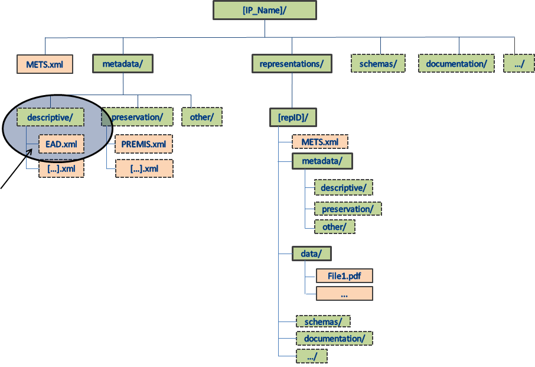
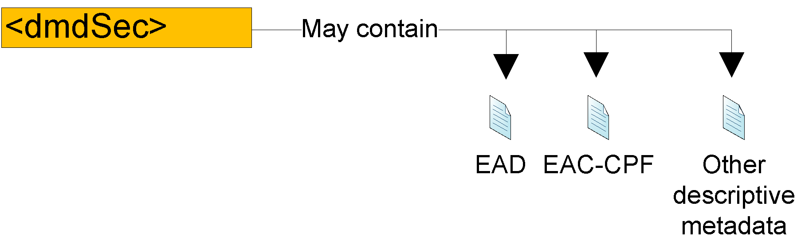
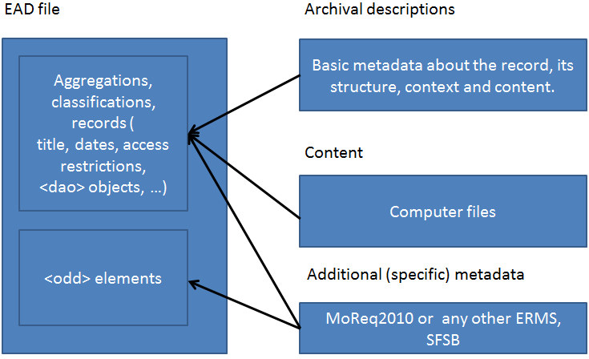
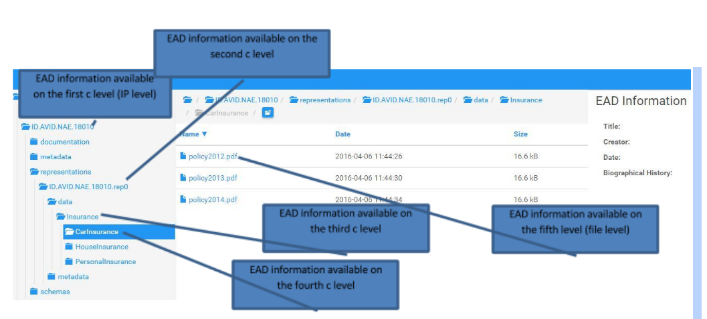

# ​3.1.2​ Metadata in the DIP

The DIP metadata is based upon the existing common, SIP and AIP specifications. The metadata descriptions provided in this document cover the three core metadata categories: structural[^43] (METS[^44]); preservation[^45] (PREMIS[^46]); and descriptive[^47] (EAD[^48])).

[^43]: Structural metadata describes the physical and/or logical structure of digital resources. The standard that E-ARK recommends for structural metadata is METS.

[^44]: Metadata Encoding and Transmission Standard. The METS schema is a standard for encoding descriptive, administrative, and structural metadata regarding objects within a digital library, expressed using the XML schema language of the World Wide Web Consortium. The standard is maintained in the Network Development and MARC Standards Office of the Library of Congress, and is being developed as an initiative of the Digital Library Federation - <http://www.loc.gov/standards/mets/>

[^45]: Preservation metadata is an essential component of most digital preservation strategies. Preservation metadata is information that supports and documents the digital preservation process - https://en.wikipedia.org/wiki/Preservation\_metadata
The standard that E-ARK recommends for preservation metadata is PREMIS.

[^46]: The Preservation Metadata: Implementation Strategies. The PREMIS Data Dictionary for Preservation Metadata is the international standard for metadata to support the preservation of Digital Objects and ensure their long-term usability - http://www.loc.gov/standards/premis/

[^47]: Also named Descriptive Information in OAIS: The set of information, consisting primarily of Package Descriptions, which is provided to Data Management to support the finding, ordering, and retrieving of OAIS information holdings by Consumers - <http://public.ccsds.org/publications/archive/650x0m2.pdf>.
The standard that E-ARK recommends for descriptive metadata is EAD.

[^48]: Encoded Archival Description. A non-proprietary de facto standard for the encoding of Finding Aids for use in a networked (online) environment. EAD allows the standardization of collection information in Finding Aids within and across repositories. EAD3 About [[http://www.loc.gov/ead/eadabout.html]{.underline}](http://www.loc.gov/ead/eadabout.html).

The DIP is based on the AIP, and structural and preservation metadata are thus always - slightly modified - present in the DIP. The METS file is in the root folder, and its schema file (mets.xsd) is in the /schemas folder. The greater part of the Access Software assumes the existence of an EAD and a PREMIS file in the root /metadata/descriptive folder and in the root /metadata/preservation/ folder respectively. Consequently it is also assumed that pertaining schema files (ead3.xsd; premis.xsd) are present in the /schemas folder.

## ​3.1.2.1​ METS

METS (Metadata Encoding and Transmission Standard) is a standard for encoding descriptive, administrative, and structural metadata expressed using the XML Schema Language.

The XML Schema for METS for an E-ARK DIP is the same XML schema as for an E-ARK AIP (i.e. the same mets.xsd file[^49]).

[^49]: Over time the METS versions will change and therefore they may be a difference in version between the AIP and the DIP, but we assume that the AIP will be migrated and therefore that the difference will not occur or at least be small.

The XML instance for METS for an E-ARK DIP is based on the same instance as an E-ARK AIP (i.e. different mets.xml files).

The differences between a METS instance for an E-ARK DIP vs an E-ARK AIP are small. Actually, most of the metadata differences between an AIP and a DIP are in the PREMIS and the EAD metadata.

The DIP specification is limited to include one and only one representation from an AIP (for which many may exist). The chosen representation is itself an E-ARK IP and therefore follows the same structure. This is reflected in the IP being migrated from an AIP to a DIP. Below is a broad overview of the METS file.

**Table 3 - Broad overview of the METS file**

&nbsp;  | Elements    |           |           | Values                     |Comments
--------|-------------| ----------|-----------|----------------------------|---------------------
**mets**|             |           |           |                            |
&nbsp;  |**metsHdr**  |           |           |                            | 
&nbsp;  |             |**agent**  |           |                            |software or archivist creating the DIP
&nbsp;  | **dmdSec**  |           |           |                            |
&nbsp;  |             |**mdRef**  |           | *EAD*                      |information about the EAD file
&nbsp;  | **amdSec**  |           |           |                            |
&nbsp;  |             |**mdRef**  |           |*PREMIS*                    |information about the PREMIS file
&nbsp;  | **fileSec** |           |           |                            |
&nbsp;  |             |**fileGrp**|           |*Common Specification root* |
&nbsp;  |             |           |**fileGrp**|*metadata*                  |
&nbsp;  |             |           |**fileGrp**|*representations*           | normally only one repr. in the DIP
&nbsp;  |             |           |**fileGrp**|*schemas*                   |
&nbsp;  |             |           |**fileGrp**|*documentation*             |
&nbsp;  |**structMap**|           |           |                            |
&nbsp;  |             | **div**   |           |*metadata*                  |
&nbsp;  |             | **div**   |           |*representations*           |mets pointer to mets file for the repr.
&nbsp;  |             | **div**   |           |*schemas*                   |  
&nbsp;  |             | **div**   |           |*documentation*             |  

In the following the major differences between an XML instance for METS for an E-ARK DIP vs an E-ARK AIP are listed.

**Table 4 - Differences between the AIP METS and the DIP METS on node level: mets**
**Node level: mets**

**Element / Attribute**|**Cardi&shy;nality**|**Description and usage in Common specification**| **Change for DIP**
----------------------|---------------|-------------------------------------------------|-------------------
mets     | 1..1 | The root level element that is required in all METS documents| No change  
\@ID     | 0..1 | Optional, no further requirements | No change
\@OBJID  | 1..1 | Mandatory in this specification. It is recommended that it be the same as the name or ID of the package (the name of the root folder). The OBJID must meet the Common Specification requirement of being unique at least across the repository | Change the value of the attribute OBJID is changed to a new value reflecting the change in the IP from an AIP to a DIP.
\@LABEL  | 0..1 | Optional, if used should be filled with a human-readable description of the package | Change - Recommended to be "METS file describing the DIP matching the OBJID"                                              |
\@TYPE   | 1..1 | Mandatory in this specification. The TYPE attribute must be used for identifying the type of the package (genre), for example ERMS, RDBMS, digitised construction plans. However, there is no fixed vocabulary and as such implementers are welcome to use values most suitable for their needs. | No change    
\@CONTENTTYPE&shy;SPECIFICATION | 0..1 | An attribute added by this specification. It describes which content information type specification is used for the content. Values of the attribute are fixed in the following vocabulary: SMURFERMS * SMURFSFSB * SIARD1 * SIARD2  SIARDDK * GeoVectorGML * GeoRasterGeotiffNB The vocabulary is extensible as additional content information type specifications are developed. | Change to one of these: SMURFERMS, SMURFSFSB, SIARD1 SIARD2 SIARDDK, OLAPCube, GeoVectorGML GeoRasterGeotiff
\@PROFILE | 1..1 | Mandatory in this specification. The PROFILE attribute has to have as its value the URL of the official Common Specification METS Profile. | No change        

**Table 5 - Differences between the AIP METS and the DIP METS on node level: metsHDR**
**Node level: metsHdr** 

|  Element/ Attribute | Cardi&shy;nality | Description and usage |  Change for DIP 		        |
|---------------------|-------------|-----------------------|-----------------------------|
| metsHdr  |0..1|Element for describing the package itself  |  			  			 		        
| @ID 		 |0..1|Optional, no further requirements | No change |
| @ADMID 	 |0..1|Optional, referring to the appropriate administrative metadata section, if used for metadata about the package as a whole. |No	change|
| @CREATEDATE |1..1|Mandatory, the date of creation of the package | Change	to creation date for DIP|
| @LASTMODDATE|0..n|Mandatory if relevant (in case the package has been modified)|Change to date of modification, if DIP has been created in several steps.|
| @RECORDSTATUS|0..1|Optional, no further requirements|No change|
| @PACKAGETYPE|1..1|An attribute added by the Common Specification for describing the type of the IP. The vocabulary to be used contains values:SIP, AIP, DIP, AIU, AIC. The vocabulary is managed by the DAS Board and will be updated when required.| Change	to DIP |
|agent|1..n|The metsHdr must include at least one agent describing the software which has been  to create the package (TYPE=”OTHER” ROLE=”CREATOR” OTHERTYPE=”SOFTWARE”).Description of all other agents is optional.|  			  			 	|
| agent/@ID|0..1|An ID for the agent.|No change|
| agent/@ROLE|1..1|The role of the agent. The Common Specification requires describing at least one agent with the agent/@ROLE value “CREATOR”. For other (optional) occurrences of agent this attribute shall use a value from the fixed list provided by METS.|No change|
| agent/ @OTHERROLE|0..1|A textual description of the role of the agent in case the value of agent/@ROLE is “OTHER”.|No change|
| agent/ @TYPE|0..1|The Common Specification requires that at least one instance of the agent element includes the agent/@TYPE attribute with the value “OTHER”. In other occurrences of the agent element the attribute is optional. If used, values defined in official METS documentation shall be followed (“individual”, “organisation”, “other").|No change|
| agent/ @OTHERTYPE|0..1|The Common Specification requires that at least one instance of the agent element includes the agent/ @OTHERTYPE attribute with the value “SOFTWARE”. In other occurrences this attribute shall only be used in case the value of agent/@TYPE is “OTHER”.|No change|
| agent/ name|1..1|The name of the agent. In the Common Specification occurrence of the agent element this element must provide the name of the software tool which was used to create the IP. |Change to name of the agent that created the DIP from the AIP|
| agent/ note|0..1|Additional information about the agent. We recommend using this element toprovide version information for the tool which was used to create the IP. | Change to version no. for the DIP creation software.|
| altRecordID|0..n|A container for an alternative ID for the package content.|No change|
| altRecordID/ @ID|0..1|An ID for the altRecordID element within the METS document.|No change|
| altRecordID/ @TYPE|0..1|Used to describe the type of ID assigned. It is recommended to use the Library of Congress vocabulary for this element when used.|No change|
| metsDocumentID |0..1|A unique identifier for the METS document itself.|No change|
| metsDocumentID/ @ID|0..1|The ID of the metsDocumentID element.|No change|
| metsDocumentID/ @TYPE|0..1|The type of the identifier assigned to the element.|No change|

**Table 6 - Differences between the AIP METS and the DIP METS on node level: dmdsec**
**Node level: dmdSec**

| Element/ Attribute|Cardi&shy;nality|Description and usage|Change for DIP|
|-------------------|-----------|---------------------|--------------|
|dmdSec|0..n|Must be used if descriptive metadata about the package content is available. NOTE: According to official METS documentation each metadata section must describe one and only one set of metadata. As such, if 	implementers want to include multiple occurrences of descriptive metadata into the package this must be done by repeating the whole dmdSec element for each individual metadata. | No change. The DIP spec. assumes the EAD is in the AIP. The EAD is needed to find the AIP with the desired content.|
|@ID|1..1|Mandatory, identifier must be unique within the package|No change|
|@GROUPID|0..1|Can be used to group together different metadata sections.|No change|
|@ADMID|0..1|In case administrative (provenance) metadata is available and described within METS about changes to the descriptive metadata, this element must reference the appropriate ID of the administrative metadata section. |No change|
|@CREATED|1..1|Required by the Common Specification. Creation date of the metadata in this section, needed to track changes to metadata files.|No change|
|@STATUS|0..1|Status of the metadata. Recommended for use to indicate currency of package. If used it is recommended to use one of the two values “SUPERSEDED” or “CURRENT”. |No change|
|/mdRef|0..1|Reference to the descriptive metadata file stored in the “metadata” folder of the IP. In each occurrence of the dmdSec exactly one of the elements mdRef or mdWrap must be present. The Common Specification recommends the use of mdRef over mdWrap |  			  			 		        |
|@ID|0..1|Unique ID for the mdRef section within the METS document.|No change|
|@MIMETYPE|0..1|The IANA media type for the external file.|No change|
|@LABEL|0..1|A name for the referenced file.|No change|
|@XPTR|0..1|Locates the point within a file to which the mdRef element refers, if applicable, using any valid XPointer scheme.|	No change|
|@LOCTYPE|1..1|Specifies the locator type used in the xlink:href which points to the file.|No change|
|@OTHERLOCTYPE|0..1|Required when mdRef/@LOCTYPE=“OTHER”.|No change|
|@MDTYPE|1..1|Specifies the type of metadata in the linked file. Values should be taken from the METS list provided. |No change|
|@MDTYPEVERSION|0..1|The version of the metadata type described in MDTYPE |No change|
|@OTHERMDTYPE|0..1|The type of metadata when MDTYPE=”OTHER”|No change|
|@SIZE|0..1|Size of linked file in bytes |No change|
|@CREATED|0..1|Date the linked file was created|No change|
|@CHECKSUM|0..1|The checksum of the linked file|No change|
|@CHECKSUMTYPE|0..1|The type of checksum used for calculating the checksum of the linked file|No change|
|/mdWrap|0..1|Wrapper for descriptive metadata embedded into the METS document. In each occurrence of the dmdSec exactly one of the elements mdRef or mdWrap must be present. The Common Specification recommends the use of mdRef over mdWrap|No change|
|@ID|0..1|Unique ID for the mdWrap section within the METS document.|No change|
|@MIMETYPE|0..1|The IANA mime type for the wrapped metadata.|No change|
|@LABEL|0..1|A name for the associated metadata.|No	change|
|@MDTYPE|1..1|Specifies the type of embedded metadata. Values should be taken from the METS list provided.|No change|
|@MDTYPEVERSION|0..1|The version of the metadata type described in MDTYPE|No change|
|@OTHERMDTYPE|0..1|The type of metadata when MDTYPE=”OTHER”|Nochange 		        |
|@SIZE|0..1|Size of associated metadata in bytes|No change|
|@CREATED|0..1|Date the embedded metadata was created|No change|
|@CHECKSUM|0..1|The checksum of the wrapped content|No change|
|@CHECKSUMTYPE|0..1|The type of checksum used for calculating the checksum of the embedded metadata|No change|
|/binData|0..1|A wrapper element to contain Base64 encoded metadata|No change|
|/xmldata|0..1|A wrapper element to contain XML encoded metadata|No change|

**Table 7 - Differences between the AIP METS and the DIP METS on node level: amdsec** 
**Node level: amdSec**

|Element/ Attribute|Cardi&shy;nality|Description and usage|Change for DIP|
|-----------------|------------|---------------------|---------------|
|amdSec|0..n|In case administrative / preservation metadata is available, it must be described using the amdSec element. 		          |Mandatory for DIP|
|@ID|0..1|Unique ID for the amdSec within the METS document|No change|
|digiprovMD|0..n|The Common Specification recommends the use of PREMIS metadata for recording information about preservation events. If used, PREMIS metadata must appear in a digiprovMD element, either embedded or linked. It is mandatory to include one 			digiprovMD element for each external file in the “metadata/preservation” folder, or for each embedded set of PREMIS metadata.|The DIP spec. assumes that a PREMIS file is updated or created during the AIP to DIP migration|
|techMD|0..n|The use of techMD is not recommended. Instead, detailed technical metadata should be included into or referenced from appropriate PREMIS files|No change|
|rightsMD|0..n|Optional. The Common Specification recommends including a simple rights statement which describes the overall access status of the package with the following values: Open, Closed, Partially closed, Not known. However, the exact schema and element is up to individual implementations to decide |No change|
|sourceMD|0..n|Optional, no further requirements| No change|

**Table 8 - Available attributes**
The following attributes are available for use with each of the four specific metadata areas listed above (xxx below stands for amdSec/digiprovMD, amdSec/techMD, amdSec/rightsMD and amdSec/sourceMD).

|Element/ Attribute|Cardi&shy;nality|Description and usage|Change for DIP|
|-----------------|------------|---------------------|---------------|
|xxx/ @ID|1..1|Mandatory for each of the four elements amdSec/digiprovMD, amdSec/techMD, amdSec/rightsMD and amdSec/sourceMD. Identifier must be unique within the package |No change|
|xxx/@GROUPID | 0..1 | Optional, no further requirements | No change |
|xxx/ @ADMID | 0..1 | In case administrative (provenance) metadata is available and described within METS about changes to the metadata occurrence described here, this element must reference the appropriate ID of the administrative metadata section. | No change |
|xxx/ @CREATED | 0..1 | Optional, no further requirements | No change |
|xxx/ @STATUS | 0..1 | Recommended for describing currency of metadata. If used, must include one of the two values “superseded” or “current” | No change |

**Table 9 - Differences between the AIP METS and the DIP METS on node level: filesec** 
**Node level: filesec**

|Element/ Attribute|Cardi&shy;nality|Description and usage|Change for DIP|
|-----------------|------------|---------------------|---------------|
| fileSec | 0..1 | Recommended to include one fileSec element in each METS file | No change |
| @ID | 0..1 | Recommended. The identifier must be unique within the METS file. | No change |
| /fileGrp | 1..n | This specification requires that one specific occurrence of the fileGrp element is included as described above. Implementers are welcome to define and add additional file groups necessary for internal purposes. The main fileGrp element includes additional nested fileGrp elements, one for each folder of the package (except metadata described in amdSec and dmdSec). | No change |
| /fileGrp/@ID | 0..1 | Recommended, identifier must be unique within the package | No change |
| /fileGrp/ @VERSDATE | 0..1 | Version date of the file grouping | No change |
| /fileGrp/ @ADMID | 0..1 | In case administrative metadata is available and described within METS about the file group, this element must reference the appropriate ID of the administrative metadata section. | No change |
| /fileGrp/ @USE | 1..1 | Recommended in Common Specification with one occurrence bearing the values “Common Specification root” (for the root fileGrp element and the names of appropriate folders for nested fileGrp occurrences. | No change |
| /fileGrp/file | 1..n | The Common Specification requires that fileGrp must contain at least one file element either pointing to content files with FLocat or wrapping the content files using FContent | No change |
| /fileGrp/ file/@ID | 1..1 | Mandatory, must be unique across the package | Add/update |
| /fileGrp/ file/ @MIMETYPE | 1..1 | The IANA mime type for the wrapped or linked file. Required by the Common Specification. | Add/update (reflecting change of format) |
| /fileGrp/ file/ @SEQ | 0..1 | Used to describe the sequence of files listed within the fileGrp element | No change |
| /fileGrp/ file/ @SIZE | 1..1 | Size of the linked or embedded file in bytes. Required by the Common Specification | Add/update |
| /fileGrp/ file/ @CREATED | 1..1 | Date the embedded/linked file was created. Required by the Common Specification | Add/update |
| /fileGrp/ file/ @CHECKSUM | 1..1 | The checksum of the embedded/linked file. Required by the Common Specification | Add/update |
| /fileGrp/ file/ @CHECKSUMTYPE | 1..1 | The type of checksum used for the embedded/linked file. Required by the Common Specification | No change (unless type is actually changed) |
| /fileGrp/ file/ @OWNERID | 0..1 | Unique ID of the file assigned by its owner | No change |
| /fileGrp/ file/ @ADMID | 0..1 | In case administrative metadata is available and described within METS about the file, this element must reference the appropriate ID of the administrative metadata section. | No change (e.g. link to EAD) |
| /fileGrp/ file/ @DMDID | 0..1 | Value for the ID attribute of the dmdSec containing metadata describing the content files listed in the file element. | Add/Update (e.g. link to PREMIS) |
| /fileGrp/ file/ @GROUPID | 0..1 | Provides an ID for a fileGrp containing related files. | No change |
| /fileGrp/ file/ @USE | 0..1 | Statement about intended use of the files | No change |
| /fileGrp/ file/ FLocat | | The location of each external file must be defined by the <FLocat> element using the same rules as for referencing metadata files. All references to files should be made using the XLink href attribute and the file protocol using the relative location of the file. Example: xlink:href="file:schemas/mets.xsd" | Add/Update |
| /fileGrp/ file/ FLocat/ @ID | 0..1 | An ID for the <FLocat> element | Add/Update |
| /fileGrp/ file/ FLocat/ @LOCTYPE | 1..1 | Mandatory locator pointing to the external file. | Add/Update |
| /fileGrp/ file/ FLocat/ @OTHERLOCTYPE | 0..1 | Description of the type of locator used | No change |
| /fileGrp/ file/ FContent/ @ID | 0..1 | An ID for the <FContent> element | No change - not recommended |
| /fileGrp/ file/ FContent/ @USE | 0..1 | Statement about intended use of the embedded file | No change - not recommended |

**Table 10 - Differences between the AIP METS and the DIP METS on node level: structmap**
**Node level: structmap**

|Element/ Attribute|Cardi&shy;nality|Description and usage|Change for DIP|
|-----------------|------------|---------------------|--------------|
| structMap | 1..n | Each METS file needs to include exactly one structMap element used exactly as described in this table. Institutions can add their own additional custom structural maps as separate structMap sections. | No change |
| @ID | 0..1 | Optional, but if used must be unique within the package | No change |
| @TYPE | 1..1 | Mandatory in this specification. The value must be “physical” | No change |
| @LABEL | 1..1 | Mandatory in this specification. The value must be “Common Specification structural map” | No change |
| /div | 0..n | Each folder (and sub-folder) within the package must be represented by an occurrence of the <div> element. Please note that sub-folders must be represented as nested div elements. Example: '<structMap TYPE="physical" LABEL="Common Specification structural map"> <div LABEL="Package123"> <div LABEL="metadata">' | No change |
| /div/@ID | 1..1 | Mandatory, identifier must be unique within the package | No change |
| /div/@TYPE | 0..1 | No specific requirements | No change |
| /div/@LABEL | 1..1 | Mandatory, value must be the name of the folder (“metadata”, “descriptive”, “schemas”, “representations”, etc). The LABEL value of the first div element in the package is the ID of the package | No change |
| /div/@DMDID | 0..1 | ID attribute values identifying the dmdSec, elements in the METS document that contain or link to descriptive metadata pertaining to the structural division represented by the current div element | Add/Update |
| /div/@ADMID | 0..1 | No specific requirements | Add/Update |
| /div/@ORDER | 0 | Not used in the specific Common Specification structMap occurrence | No change |
| /div/ @ORDERLABEL | 0 | Not used in the specific Common Specification structMap occurrence | No change |
| /div/ @CONTENTIDS | 0..1 | IDs for the content in this division. No specific use requirements. | No change |
| /div/fptr | 0..n | If the folder which is described by the div element includes computer files these must be referenced by using the fptr element. The only exception is the description of representations (see below for the use of mptr). The fptr child elements par, seq and area must not be used. | Add/Update |
| /div/fptr/@ID | 0..1 | No specific requirements | No change |
| /div/ fptr/ @FILEID | 1..1 | Mandatory, must be the ID used in the appropriate file or mdRef element | Add/Update |
| /div/ fptr/ @CONTENTIDS | 0..1 | IDs for the content referenced by this fptr element. No specific requirements | No change |
| /div/div/mptr | 0..n | In the case of describing representations within the package (i.e. representations/representation1) the content of the representations must not be described. Instead the <div> of the specific representation should include one and only one occurrence of the <mptr> element, pointing to the appropriate representation METS file. The references to representation METS files must be made using the XLink href attribute and the file protocol using the relative location of the file. Example: xlink:href="file:representation/ representation1/mets.xml" The XLink type attribute is used with the fixed value “simple”. Example: xlink:type="simple" The LOCTYPE attribute is used with the fixed value ”URL” | No change |
| /div/ div/ mptr/@ID | 0..1 | Unique ID for this element | No change |
| /div/ div/ mptr/ @LOCTYPE | 0..1 | The locator type used in the xlink:href attribute | No change |
| /div/ div/ mptr/ @OTHERLOCTYPE | 0..1 | Locator type in xlink:href when LOCTYPE=”OTHER” | No change |
| /div/ div/ mptr/ @CONTENTIDS | 0..1 | The content ID for the content represented by the mptr element. | No change |

#### ​3.1.2.2​ PREMIS
PREMIS is a standard that mainly caters for long-term preservation and technical usability, which for example is used to facilitate a range of preservation strategies including migration and emulation.
From an Access perspective, PREMIS especially satisfies the requirements pertaining to the recording of Representation Information. It is practical to state in a formalised and consistent way how the Access Software should behave and where it should look when dealing with different pieces of information, such as which representation formats are included in the DIP. Therefore all E-ARK Access Software assumes the availability of PREMIS metadata according to the specification below.

##### ​3.1.2.2.1​ Metadata regarding Representations and Access Software
In PREMIS, a representation is a "set of files, including structural metadata, needed for a complete and reasonable rendition of an Intellectual Entity."[^50].

[^50]: PREMIS Editorial Committee (2015). "PREMIS Data Dictionary for Preservation Metadata", p.8.

One of the core concepts in PREMIS is the above formulated definition of a representation, but it is also important to note that the E-ARK Common Specification Information Package structure also incorporates physical management of different representations. When implementing PREMIS in E-ARK packages one must therefore choose if there must exist PREMIS files at representation level or at root level only (see Common Specification) and one must also choose how fine-grained each description should be.

In PREMIS, a representation is indicated using the semantic unit "1.1 objectIdentifier". In E-ARK Access, as already mentioned, the DIP representation formats are SMURF ERMS, SMURF SFSB, SIARD1.0, SIARD2.0, SIARDDK, OLAP, GML, and GeoTIFF. It is important to emphasise that the E-ARK project has neither created specifications nor tools for specific file formats[^51] (fine-grained descriptions), but only for the aforementioned DIP *representation formats*.

[^51]: For example PDF or JPG.

Hence, the Access Software developed by the E-ARK project does guarantee the rendering of the E-ARK 
representations, but not of specific file formats contained *inside* an E-ARK representation. As an example, the SMURF ERMS could contain several file formats unknown to the E-ARK IP Viewer[^52] (note: even though this is unlikely, because archives generally make sure that the number of file formats that they preserve is limited and their use widespread. As such for example PDF or TIFF files would be rendered).

[^52]: The generic Access tool that allows for the rendering of the DIP reference format, ie. the folder structure, descriptive metadata,and the most common file formats, cf. D5.4 Search, Access and Display Interfaces. http://www.eark-project.com/resources/project-deliverables/92-d54

To enable rendition, three pieces of information are needed in PREMIS: One identifying the representation to be rendered; one identifying the software to enable this; and one establishing a
To enable rendition, three pieces of information are needed in PREMIS: One identifying the representation to be rendered; one identifying the software to enable this; and one establishing a relationship between the two.

The descriptions below therefore show how to:
1.  Describe which DIP representation format is contained in the DIP (description 1 below);
2.  Describe which piece(s) of Access Software is/are needed to render a specific DIP representation format. Several pieces of software may indeed be needed (description 2 below);
3.  Describe the relationship between the DIP representation format and its Access Software (description 3 below).

###### ​3.1.2.2.1.1​ Description 1 - The recording of DIP representation formats
In order to describe the specific DIP representation format the semantic component "1.4 significantProperties" is used. An example is:

**Table 11 - Recording of DIP representation formats**
```xml
<object xsi:type=\"representation\"\>\                                                               
 <objectIdentifier\>\                                                                                 
  <objectIdentifierType\>filepath\</objectIdentifierType\>                                                                                                                                                    
  <objectIdentifierValue\>xlink:href=\"representations\\AVID.SA.18006.rep0\"\</objectIdentifierValue\>                                                                                                        
 </objectIdentifier\>\                                                                                
 <significantProperties\>\                                                                            
  <significantPropertiesType\>DIP representation format\</significantPropertiesType\>\                 
  <significantPropertiesValue\>SIARD2\</significantPropertiesValue\>\                                  
 </significantProperties\>\                                                                           
<!-- PREMIS file continues but further elements left out in this example-->                     
```
Note that the object type is "representation" and that the objectIdentifierType value is "filepath", which according to the AIP specification is an IP scope value. The objectIdentifierValue is the filepath to the representation folder or could be a filepath to a file.

###### ​3.1.2.2.1.2​ Description 2 - The recording of Access Software
In PREMIS 3.0 a description of an environment has become an object itself, so that both non-environmental objects and environmental objects exist. Access Software is therefore an environmental object which per default is an intellectual entity. The semantic unit "1.9 environmentFunction" is conceived to describe the environment object(s) with different levels of granularity. It is suggested to use the vocabulary from Library of Congress[^53]. The semantic unit "1.10 environmentDesignation" is used for information identifying the environment by using human-readable language which can be expected to be understood outside of a digital repository.

[^53]: Library of Congress. environmentFunctionType. Retrieved the 18th of January 2017 at: Environment Function Type [[http://id.loc.gov/vocabulary/preservation/environmentFunctionType.html]{.underline}](http://id.loc.gov/vocabulary/preservation/environmentFunctionType.html)

See the example which follows this vocabulary:

**Table 12 - Recording of Access Software**
```xml
<object xsi:type="intellectualEntity">
     <objectIdentifier>
         <objectIdentifierType>local</objectIdentifierType>
         <objectIdentifierValue>DBVTK</objectIdentifierValue>
     </objectIdentifier>
     <environmentFunction>
         <environmentFunctionType>software</environmentFunctionType>
         <environmentFunctionLevel>1</environmentFunctionLevel>
     </environmentFunction>
     <environmentFunction>
         <environmentFunctionType>software application</environmentFunctionType>
         <environmentFunctionLevel>2</environmentFunctionLevel>
     </environmentFunction>
    <environmentDesignation>
	<environmentName>Database Visualization Toolkit</environmentName>
	<environmentVersion>2.4.1</environmentVersion>
	<environmentDesignationNote>Lightweight web viewer for relational databases, specially if preserved in SIARD 2, that uses SOLR as a backend, and allows browsing, search, and export. Documentation at github.com/eark-project/software/DBVTK</environmentDesignationNote>
	</environmentDesignation>
</object>
```

###### ​3.1.2.2.1.3​ Description 3 - The recording of the relation between the representations and the Access Software

In order to establish a connection between the DIP representation format to be rendered and the Access

Software to render it, it is necessary to use the semantic unit "1.13 relationship". The relationship element can bind both non-environmental objects together with environmental objects and it can bind environmental objects together with other environmental objects. The following example shows how the DIP representation format from Table 11 can be related to the Access Software from Table 12:

**Table 13 - Recording of Access Software**
```xml
<object xsi:type="representation">   
   <objectIdentifier> 
      <objectIdentifierType>filepath</objectIdentifierType>
      <objectIdentifierValue>xlink:href="representations\AVID.SA.18006.rep0"</objectIdentifierValue>         
   </objectIdentifier>
   <significantProperties>
      <significantPropertiesType>DIP representation format</significantPropertiesType>
      <significantPropertiesValue>SIARD2</significantPropertiesValue>
   </significantProperties>
   <!-- The following is the relation between the software and the DIP representation --> 
   <relationship>
       <relationshipType>dependency</relationshipType> 
       <relationshipSubType>requires</relationshipSubType>
       <relatedObjectIdentifier>
           <relatedObjectIdentifierType>local</relatedObjectIdentifierType>
           <relatedObjectIdentifierValue>DBVTK</relatedObjectIdentifierValue>
         </relatedObjectIdentifier>
       <relatedEnvironmentPurpose>render</relatedEnvironmentPurpose> 
   </relationship>
</object>
```

As can be seen in Table 13 (above) the nature of the relationship, \<relationshipType\> is used (value, e.g. 'dependency'); intimately linked to this is also the indication of a \<relationshipSubType\>, e.g. 'requires'.

In order to identify the Access Software, which is used to render the representation, the \<relatedObjectIdentifier\> is employed; and the \<relatedEnvironmentPurpose\> gives us a hint about what the purpose is (here: to 'render').

Since it is not always possible to render the DIP representation formats with one piece of Access Software, it can be necessary to model software dependencies and sequences between several pieces of software in PREMIS.

#### ​3.1.2.3​ EAD
Descriptive metadata are used to describe the intellectual contents of archival holdings, and they support finding and understanding individual information packages. The E-ARK project allows for the inclusion of any kind of descriptive metadata in the E-ARK IP[^54]. These go into the 'descriptive/' folder as seen in the example below, Figure 3 (cf. EAD.xml).

[^54]: For E-ARK pilots, most of the Access Software used the EAD3 standard. They can however be tweaked to use other descriptive metadata.

**Figure 3 - E-ARK IP descriptive metadata**


The METS descriptive metadata element \<dmdSec\> references descriptive metadata as seen in Figure 4 below and as such descriptive metadata are not to be included into the METS file.
**Figure 4 - METS descriptive metadata**


The EAD file has three main inputs (Figure 5 below):
-   Archival descriptions. Contains main archival descriptions (including metadata about aggregations and classification).
-   Content. Contains links to computer files and folders as \<dao\> elements and \@base attributes respectively.
-   Additional metadata. Specific information that does not fit into the EAD3 standard elements can be saved as \<odd\> elements or localtype attributes in EAD3 elements (see localtype example below in section 'Search').

**Figure 5 - Inputs to the EAD file**


##### ​3.1.2.3.1​ Tools
The tools that the E-ARK project is building will by default only be able to cope with EAD3, because EAD3 is the descriptive metadata standard that E-ARK has chosen. This does not mean that the tools cannot be configured so they can also cope with other descriptive metadata standards. For example, in E-ARK web there is a generic task for descriptive metadata. It would be easy to adapt this task to Dublin Core, for example, if required. The only thing that is required to do so is a convention which defines how to determine the metadata that belong to a file item in the context of a metadata format.

The tools in E-ARK that use EAD are:
-   ERMS Export Module (EEM)
-   EAD Editor
-   RODA
-   ESS tools
-   E-ARK Web including Apache Hadoop, Lily and Solr.
-   Access Software
    -   Search GUI
    -   Order Management Tool
    -   DIP Viewer

##### ​3.1.2.3.2​ Search
To support the development of a search interface, it is required to make certain metadata elements available in the Solr index[^55], either by using the Lily indexer[^56] or via the AIP indexing task, which adds content to the Solr index by creating one document[^57] per contained file in the IP. These Solr documents include basic properties such as \"path\", \"package\", \"contentType\", \"size\", and can be further enriched by running a subsequent job which parses EAD metadata files to search for \<dao\> tags. If such a tag is found, the metadata fields of the first c-level tag in the ancestry path of the \"data\" element (e.g. the \"title\" field) are added to the Solr document. If no \<dao\> element is found, the entire EAD/c (component) is indexed and associated with all files in a given IP. This aims to support scenarios where no \<dao\> elements are provided as part of the description.

[^55]: Apache Solr Reference Guide Solr Indexing https://cwiki.apache.org/confluence/display/solr/Introduction+to+Solr+Indexing

[^56]: The dm-file-ingest component: https://github.com/eark-project/dm-file-ingest

[^57]: A document in Solr terminology is Solr\'s basic unit of information, which is a set of data that describes something. A document about a person, for example, might contain the person\'s name, biography, favorite color, and shoe size. A document about a book could contain the title, author, year of publication, number of pages, and so on. Cf. Apache Solr Reference Guide Overview of Documents, Fields, and Schema Design https://cwiki.apache.org/confluence/display/solr/Overview+of+Documents,+Fields,+and+Schema+Design

The following fields have been mapped to Solr and created in Lily\_Solr and are thus indexed and searchable from the E-ARK Search GUI:

**Table 14 - EAD to Solr mapping**
  **EAD element**                 |**Value access path**        |**SolR field**
  ------------------------------- |----------------------------| ----------------------------------
  ead:unitid                      |.                            |eadid\_s (String)
  ead:unittitle                   |.                            |eadtitle\_s (String)
  ead:unitdate                    |.                            |eaddate\_s (String)
  ead:unitdatestructured          |ead:datesingle               |eaddatestructuredfrom\_dt (Date)
  ead:unitdatestructured,         |ead:datesingle               |eaddatestructuredto\_dt (Date)
  ead:unitdatestructured          |ead:daterange/ead:fromdate   |eaddatestructuredfrom\_dt (Date)
  ead:unitdatestructured          |ead:daterange/ead:todate     |eaddatestructuredto\_dt (Date)
  ead:origination                 |ead:\*/ead:part              |eadorigination\_s (String)
  ead:abstract                    |.                            |eadabstract\_t (Text)
  ead:accessrestrict              |ead:head                     |eadaccessrestrict\_s (String),
  ead:(\[Cc\]\[0,1\]\[0-9\]\|C)   |\@level (attribute)          |eadclevel\_s (String)

Note that the element selector can be a regular expression: (\[Cc\]\[0,1\]\[0-9\]\|C) matches either C01, C02, ..., C20 or the C-element without numeric suffix. The value access path "\@level (attribute)" means that the value of the attribute "level" of the selected C- or C{n}element is accessed. The expression ead:\*/ead:part allows accessing the element's value with any EAD child element of ead:origination which has the child element ead:part.

Elements which are not part of the original EAD3 can be represented by \<odd\> elements, cf. the SMURF profile[^58].

[^58]: D3.3 E-Ark SMURF http://www.eark-project.com/resources/project-deliverables/52-d33smurf

For example a new element for keywords:

**Table 15 - EAD example of new element for keywords**
```xml
<c level="item">
 <did>
  …
   <!--System set date and time when the entity was created. “Created” is user-defined value.-->
   <unitdate datechar="created">2004-05-25T00:00:00</unitdate>
  …
   <!--Other Descriptive Data. “Keyword” attribute is user-defined.-->
  <odd localtype="Keyword">
   <list>
    <item>keyword A</item>
    <item>keyword B</item>
    <item>keyword C</item>
   </list>
  </odd>
```

##### ​3.1.2.3.3​ Hierarchical archival descriptions
The component tag (\<c\>) is "An element that designates a subordinate part of the materials being described."[^59]. The hierarchical archival descriptions (units of description) will be addressed using the unnumbered component tag (\<c\>).

[^59]: EAD3 \<c\> http://www.loc.gov/ead/EAD3taglib/index.html\#elem-c

The Access Software will be developed so that it can address all hierarchical levels in a description of the Archive\'s collections, thus providing user friendly information for all the levels of intellectual content, which have effectively been described in the descriptive metadata file.

The example below shows how the descriptions of the hierarchical levels can be displayed in the IP Viewer:

**Figure 6 - Illustration of the E-ARK use of the EAD component tag \<c\>**


The E-ARK project has chosen the unnumbered component tag (\<c\>) as opposed to the numbered one (\<cNN\>) because it is more generic, less resource demanding to implement, and because it provides more flexibility and more interoperability: First of all there is no upper limit to the number of levels when choosing \<c\> (whereas there are 12 in \<cNN\>). Also, a hierarchy is implicit from the archive\'s vocabulary (series, sub-series, etc.) and reflects each local archive's way of describing descriptive units; the \<c\> component is defined as an argument using the level (\@level) attribute[^60], e.g. \<c level=\"file\"\>. With \<cNN\> we would need to define the meaning for each number and it would probably be too naive to expect that a prescriptive E-ARK solution would be adopted by all. Furthermore, it is also complicated to introduce new levels between the existing ones when using the \<cNN\> tag. Lastly, the Archives Portal Europe (APE) also uses the unnumbered tag in apeEAD and it is assumed that any compliance with APE is welcomed by the archival community.

[^60]: EAD3 \@level https://www.loc.gov/ead/EAD3taglib/index.html\#attr-level

EAD uses aggregation values as the "level" attribute on the elements \<archdesc\> and \<c\> to specify the aggregation level at which description belongs.

**Table 16 - EAD example of the use of the "level" attribute to specify the aggregation levels**
```xml
<archdesc level="fonds">
…
 <dsc>
  <c level="series">
   …
   <c level="file">
    Records and computer files
   </c>
  </c>
 </dsc>
</archdesc>
```

The exact names of aggregation levels depend on the agreements between data producers and archives. EAD3 has defined a set of values (class, collection, file, fonds, item, otherlevel, recordgrp, series, subfonds, subgrp, subseries) for that purpose, but it allows using other values as well if they are defined with the \@otherlevel attribute.
**Table 17 - EAD example of the use of \<otherlevel\>**
```xml
<archdesc level="collection">
 <did>
  <abstract>...</abstract>
 </did>
 <dsc>
  <c level="series">
   <did>
    <abstract></abstract>
   </did>
   <c otherlevel="case"> <!--A new aggregation level-->
    <did>
     <abstract>Records and computer files from ....</abstract>
    </did>
   </c>
  </c>
 </dsc>
</archdesc>
```

##### ​3.1.2.3.4​ Referencing files and folders from EAD
In order to be able to reference physical intellectual entities from within an EAD file, two mechanisms are being used: The digital archival object \<dao\> tag and the \@base attribute.

\@base is used to reference folders; \<dao\> is used to reference files.

The objectives of these mechanisms are to:
-   Connect findings in the Finding Aid to specific descriptive units in the IPs (be it files (\<dao\>) or folders (\@base));
-   Allow for an appropriate visualisation of both data and EAD metadata inside the E-ARK Access Software GUIs.

The digital archival object \<dao\> tag is "A child element of \<did\> used for linking to born digital records or a digital representation of the materials being described."[^61]. The \<did\> element is a wrapper element that encloses information essential for identifying the record:

[^61]: EAD3 \<dao\> http://www.loc.gov/ead/EAD3taglib/index.html\#elem-dao

###### ​3.1.2.3.4.1​ The \<did\> tag
The \<did\> tag is "a wrapper element that encloses information essential for identifying the material being described".[^62]. It binds together the elements that describe archival materials.

[^62]: EAD3 \<did\> https://www.loc.gov/ead/EAD3taglib/index.html\#elem-did

**Table 18 - EAD example of the \<did\> element**
```xml
  <did>
  <!--Unique identifier for a record that is generated automatically by the system.-->
  <unitid localtype="current">ERA.14-4-3-1-1</unitid>
  <!--The identifying name or title of the record.-->
  <unittitle>Final report</unittitle>
  <!--System set date and time when the entity was created. Can be represented as unitdatestructured or unitdate.-->
  <unitdate datechar="created">2004-05-25T00:00:00</unitdate>
  <!--The unit used to describe the extent of the record (e.g MB, pages, num of files/components)-->
  <physdescstructured coverage="whole" physdescstructuredtype="spaceoccupied">
      <quantity>0.4453</quantity>
      <unittype>MB</unittype>
  </physdescstructured>
  <!--<daoset> allows grouping multiple links to born digital records or digital representations of the materials being     described. If only one link is present then the <daoset> element can be replaced by <dao>.-->
  <daoset label="Digital Objects">
      <dao … />
      <dao … />
  </daoset>
</did>
```

###### ​3.1.2.3.4.2​ The \<dao\> tag and the \@base attribute
Both mechanisms are used to link to physical entities within an IP. The dao element links to files while the base attribute links to folders. It allows the Access Software to display metadata pertaining to specific files or folders so that the Consumer can easily understand what the selected element is about.

**The dao element**
The \<dao\> element is a linking element that uses href to connect to born digital records or digital representations of the record.

**Table 19 - EAD example of the \<dao\> element and the href link**
```xml
<dao id="dad603af-037b-44d5-8993-5754a42b3962" daotype="borndigital" linktitle="Report" href=file:../../representations/rep1/data/Example1.docx" />
```
The ID attribute represents a machine-processable unique identifier for the file. The daotype specifies if a file is born digital (borndigital), digitized from physical holdings (derived) or other (otherdaotype). For example, for scanned files we can point out that the files are not "original".
**Table 20 - EAD example of the \<daotype\> attribute**
```xml
<dao id="baa703af-037b-44d5-8993-5754a42b3962" daotype="derived" linktitle="Page10" href="file:../../representations/rep1/data/Page10.tif" />
```
In more complex cases (e.g. files migration) it is recommended to use both attributes (daotype, otherdaotype) as using only one attribute may be not enough for describing the file origin. For example, if a file is a result of a file format conversion from DOCX to PDF/A then we recommend using daotype=\"borndigital\" otherdaotype=\"migrated\" because the PDF/A is a born-digital and a migrated file in the same time.

**Table 21 - EAD examples of the \<daotype\> and \<otherdaotype\> attributes**
```xml
<dao id="dad603af-037b-44d5-8993-5754a42b3962" daotype="borndigital" linktitle="Report" href="file:../../representations/rep1/data/Report.doc" />

<dao id="aad248bf-037b-34d5-7993-5754b42b3971" daotype="borndigital" otherdaotype="migrated" linktitle="Report" href="file:../../representations/rep2/data/Report.pdf" />
```

**The base attribute**
The \@base attribute is "Used to specify a base URI that is different than the base URI of the EAD instance. This allows any relative URIs provided on attributes of a specific element or its descendants to be resolved using the URI provided in that element's base"[^63].

[^63]: EAD3 \@base https://www.loc.gov/ead/EAD3taglib/index.html\#attr-base

**Table 22 - EAD examples of the base attribute**
```xml
<c level="subseries" base="representations/[repID]/data/[seriesfolder]/[subseriesfolder]">
```

For reasons that have already been explained above, the \<dao\> element is not mandatory and as such an IP can just be described as a whole - ignoring all hierarchical levels -, for example using the \<abstract\> tag. The \@base is not mandatory either.

The path used in \@base is always absolute for reasons of efficiency when matching paths to folders. According to the EAD3 tag library doc, the data type of the base attribute is anyURI. The definition of anyURI is: \"A Uniform Resource Identifier. This may be a Uniform Resource Locator (URL) or a Uniform Resource Name (URN). Both relative and absolute URIs are allowed."[^64]

[^64]: Encoded Archival Description Tag Library, page 6, http://www2.archivists.org/sites/all/files/TagLibrary-VersionEAD3.pdf

###### ​3.1.2.3.4.3​ Access restrictions
The \<accessrestrict\> tag is "An element for information about conditions that affect the availability of the materials being described."[^65]**.** The Access Rights Information that concerns the *end-user* has to be available in EAD - not in PREMIS - and \<accessrestrict\> is used for this purpose. The reasons being:

[^65]: EAD3 \<accessrestrict\> http://www.loc.gov/ead/EAD3taglib/index.html\#elem-accessrestrict

-   It should be possible to find the Access Rights Information in one place and one place only, namely in the descriptive metadata, which, per default, are the metadata displayed in the Access Software (Finding Aids and different viewers).
-   EAD supports the description of potentially very complex hierarchical levels of an IP and can therefore if necessary differentiate access restrictions all the way down to the individual file level.
-   Descriptive metadata are very often added upon Ingest and Finding Aids can thus immediately be populated with this kind of information.

The \<p\> tag in \<accessrestrict\> is repeatable and can be used in the following way:

**Table 23 - EAD example of \<accessrestrict\>\
```xml
<accessrestrict>
 <p>Restricted</p>
 <p>75</p>
 <p>...</p>
</accessrestrict>
```

If the value of the first \<p\> is "Restricted" or "" (empty - which also means that it is restricted) the tool will look for a second \<p\> which specifies the restriction period. "Unrestricted" means that the IP is immediately accessible. The second \<p\> can contain any text, for example \<p\>This IP is available 20 years from November 14 2002\</p\>.

Note that the EAD3 schema validates even without the \<head\> tag inside \<accessrestrict\>.

For more complex scenarios, it is possible to use \<chronlist\> as follows:

**Table 24 - EAD example of \<chronlist\>**
```xml
<accessrestrict>
 <chronlist>
  <chronitem>
   <daterange>
    <fromdate>01.01.2016</fromdate>
    <todate>01.01.2041</todate>
   </daterange>
   <event>
    <list>
     <item>type of the restriction (e.g. personal data)</item>
     <item>duration of the restriction in years (e.g. 25 years)</item>
     <item>source of the restriction (e.g. Public access law AvTS §7)</item>
     <item>additional description of the access restriction (e.g. The content can be made public if personal data is removed from the DIP)</item>
    </list>
   </event>
  </chronitem>
 </chronlist>
</accessrestrict>
```

##### ​3.1.2.3.5​ Representations
Whenever new representations are created, a new EAD file needs to be created to include the new file items of the new representation. It replaces the old one for which a backup file with the date suffix is created at each edit. However, the IP will still only include one valid EAD file (in the 'metadata/descriptive/' folder), which references all the representations of an IP.

#### ​3.1.2.4​ Representation Information
Representation Information is particularly important to Access since it is the information which is required to understand and render both data and metadata, or, as it is stated in the OAIS, p. 1-13[^66]: "Representation Information: The information that maps a Data Object into more meaningful concepts. An example is the ASCII definition that describes how a sequence of bits (i.e., a Data Object) is mapped into a symbol."

[^66]: OAIS, blue book, 2002 https://siarchives.si.edu/sites/default/files/pdfs/650x0b1.PDF

Representation Information can be subdivided into three classes:

-   **Structural Information**: describes the format and data structure concepts to be applied to the bitstream, which result in more meaningful values like characters or number of pixels.

-   **Semantic Information**: this is needed on top of the structural information. If the digital object is interpreted by the structural information as a sequence of text characters, the semantic information should include details of which language is being expressed.
-   **Other Representation Information**: includes information about relevant software, hardware and storage media, encryption or compression algorithms, and printed documentation.

The Representation Information can be executable software, if that's helpful. Rather than having further Representation Information which defines what a PDF is, it's more helpful to simply use a PDF viewer, instead[^67]. The OAIS needs to track this carefully though, because, one day, PDF viewers may cease to exist or work properly, and the original Representation Information would then need to be updated, together with other preservation strategies like file format migration or emulation, which will bring new requirements to the necessary representation information.

[^67]: OAIS, blue book, pp. 4-21/22.

In the E-ARK projekt, we cover representation in different ways. For example by the use of the Documentation folder which is presented as a container where one can place all the information that one has collected during the pre-ingest phase which somehow helps the archivist and the Consumer to better understand the data stored in the IP. This folder fulfils well the requirements of the transfer of archival material from the producer to the archive. One does not want to over complicate the SIP creation step that is already a huge burden for most producers. Having a container that allows producers to include whatever extra documentation or information they have that may help to understand the data is a very welcome feature. Other examples of Representation Information in the E-ARK IP is the use of PREMIS to indicate rendering software of the use of EAD to increase the understandability of the preserved archival material.

On a long term, the E-ARK project proposes the use of relationship model that would enable the creation of links between an AIP and one or more "Representation Information packages". These "Representation Information packages" could very easily follow the same structure of the current E-ARK AIP, meaning that they could be composed of a metadata folder, representation folders, and all the other components that currently make up the E-ARK AIP. This particular type of AIP should be branded differently so it doesn't get confused with the regular AIPs (e.g. via a different type/role on the METS that wraps the entire AIP).

By following this strategy one could build an entire Representation Information network that follows the current specification so we could actually make use of the existing preservation action tools being developed in the project to preserve the RI. Moreover, exchanging RI in this standard way would greatly increase collaboration between institutions, enterprises and preservation experts while at the same time reducing the risk of an external registry going out of business.

The current AIP specification already includes a specific relationship between AIPs, namely a succession relationship, where an AIP point to its parent AIP (or AIC). We suggest using the same mechanism to refer to RI AIPs. The implementation would entail adding a new struct-map where the relationships with RI AIPs could be defined, and possibly also other links to external information (e.g. to the PRONOM registry). Also, we suggest adding a new AIP type called "Representation Information" which would clearly identify the AIP as not being part of the content of the repository *per se*, but extra information needed for the preservation of said content.

Since it has not been a part of the E-ARK project to implement such a proposition, we leave it at the conceptual level for the community to pick up whenever it reaches the right maturity level to do so.
