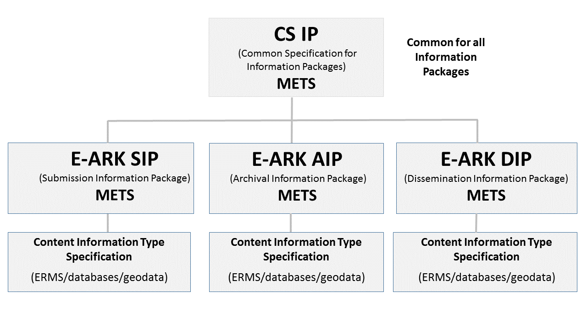

# I. Acknowledgements
The E-ARK Dissemination Information Package (DIP) Specification was first developed within the E-ARK project in 2014 – 2017. E-ARK was an EC-funded pilot action project in the Competiveness and Innovation Programme 2007- 2013, Grant Agreement no. 620998 under the Policy Support Programme.

Since the scope of the E-ARK 2014-2017 DIP specification was linked to a reference implementation, specific Content Information Types, and product development with pilot actions it was a 100 pages long document. The scope of this E-ARK DIP Specification is not the same, the document has been shortened heavily and therefore we currently only have two authors credited. This does not mean that the current authors are the only ones behind this specification. We rely heavily on the work previously done.

The authors of this specification would like to thank all national archives, tool developers and other stakeholders who provided valuable knowledge about their requirements for information packages and feedback to this and previous versions of the specification.


# II. Contact & Feedback 
The E-ARK DIP specification is maintained by the Digital Information LifeCycle Interoperability Standard Board (DILCIS Board). For further information about the DILCIS Board or feedback on the current document please consult the website http://www.dilcis.eu/ or https://github.com/dilcisboard or contact us at <info@dilcis.eu>   

# III. Authors


| Name                             | Organisation                                       |
| -------------------------------- | -------------------------------------------------- |
| Anders Bo Nielsen                | Danish National Archives                           |
| Phillip Tømmerholt               | Danish National Archives                           |


# IV. Revision History

| Revision No. | Date       | Authors(s)                       | Organisation | Description                                                           |
|--------------|------------|----------------------------------|--------------|----------------------------------------------|
| 1.0          | 20.12.2018 | Phillip Tømmerholt <br/>Anders Bo Nielsen | DNA | Review version                               |
| 1.0.1        | 20.03.2019 | Phillip Tømmerholt <br/>Anders Bo Nielsen | DNA | Corrected typos                              |
| 1.0.2        | 26.04.2019 | Phillip Tømmerholt <br/>Anders Bo Nielsen | DNA | Corrected typos                              |


# Introduction


## Scope and purpose

Key objectives of this E-ARK DIP specification are:

- To define a generic structure of the DIP format in a way that it is suitable for a wide variety of archival records, such as document and image collections, databases or geographical data.
- To recommend a set of metadata related to the structural and the access aspects of the DIP.

## Relations to other E-ARK specifications
The E-ARK DIP specification can be found in the following model (see Figure 1):




_Common Specification for Information Packages_

Common Specification for Information Packages (CS IP) identifies and standardises the common aspects of information packages (SIP/AIP/DIP) which are equally relevant and implemented by any of the functional entities of the overall digital preservation process (i.e. Ingest, Data Management, Archival Storage, Preservation Planning, Access etc). 
CS IP is a separate document as all the grey boxes are. Therefore, this E-ARK DIP specification does not aim at repeating the information presented there – only the information that is absolutely necessary to understand the DIP specification will be mentioned here. 

_SIP, AIP, and DIP Specification_

SIP, AIP, and DIP specifications are in some respects outlined to be "on the same level" in the hierarchical order of specifications, since they alle need to be compliant to the Common Specification for Information Packages.
But following the OAIS reference model, the above model can also be read from left to right since a DIP is *derived from one or more AIPs*. 
Therefore there are some cases where the DIP specification heavily relies on what is stated in the SIP and AIP specifications. 
Therefore, this E-ARK DIP specification does not aim at repeating the information presented there – only the information that is absolutely necessary to understand the DIP specification will be mentioned here.


_Content Information Type Specifications_

Content Information Type Specifications are content-dependent specifications which include detailed information on how content, metadata, and documentation for specific Content Information Types 
(for example ERMS or relational databases) is to be handled within the SIP, AIP and DIP. It is in these specifications where most implementation issues are dealt with. 

## Definition of a DIP

The OAIS reference model defines a DIP as:

> An Information Package, derived from one or more AIPs, and sent by Archives to the Consumer in response to a request to the OAIS. 


The definition of an E-ARK DIP is that it corresponds to a CS IP which is ready to be processed by its designated Access Software; if it is not suited for processing and rendering by its designated Access Software, it is not (yet) a DIP. 
This is a very generic, but handy, definition. To be more specific, an E-ARK DIP is: 

- an IP which is sent (or is ready to be sent) to the user in an Access environment; 
- supported by tools, i.e. can be rendered by Access Software.

First of all, the DIP looks like the AIP: It replicates the structure of the AIP from which it is derived. It also inherits metadata as well as the intellectual entities of the AIP. 
An E-ARK AIP may in its entirety therefore also be a E-ARK DIP, however in most cases it is necessary to convert from an AIP to a DIP.  The DIP allows for example for the inclusion of new DIP representation formats, which are more user-friendly than the AIP formats that are intended for long-term preservation purposes. 
It also allows for the updating of the metadata as well as for the addition of new metadata elements.  Representation Information, which is required for rendering and understanding the intellectual content, might also be added, and as a direct consequence, there may be a need for new folders and files, for example within the ‘Documentation’ folder.

# Structure 
The folder structure of an E-ARK DIP must comply with the requirements for the folder structure for a CS IP, see [Folder structure of the CSIP](http://earkcsip.dilcis.eu/#41-folder-structure-of-the-csip).

The CS IP folder structure and its requirements is visualised in the figure below:


- Green boxes represent folders
- Red boxes represent files. 
- Boxes with full lines represent mandatory files/folders
- Boxes with dotted lines represent optional files/folders. 

As can be seen from the figure - the requirements for the folder structure for a CS IP is at a bare minimum and makes it possible to have several extra optional folders and files in a CS IP (see boxes with dotted lines). 
The first thing to be said about the E-ARK DIP structure in regard to CS IP structure is that an E-ARK DIP will always consist of some of those files and folders that are optional in the CS IP minimum structure. 
There must be data to disseminate. Since the definition of an E-ARK DIP is that it corresponds to a CS IP which is ready to be processed by its designated Access Software, this leaves the question as to which data 
in the CS IP should be chosen to be encompassed in the E-ARK DIP. 

It is possible that an AIP in its current state and in its entirety can be delivered to a Consumer as is and still be considered an E-ARK DIP. 
That E-ARK DIP can contain the submission representation, and one or more preservation representations. Often, however, the OAIS is interested in leaving out irrelevant data and metadata and only present the 
Consumer with the data and metadata that the Consumer is interested in. This could be isolated to the content in one single representation in an E-ARK AIP, or maybe only a portion of a single representation in an E-ARK AIP. Maybe even only one specific file. The point here is that a plethora of different E-ARK DIPs can be created out of an E-ARK AIP or several E-ARK AIPs.


# **​Content Information Types**

Content Information is *“A set of information that is the original target of preservation or 
that includes part or all of that information. It is an Information Object composed of its Content 
Data Object and its Representation Information*” according to the OAIS Reference Model.

A Content Information Type can therefore be understood as a category of Content Information, for example 
relational databases, scientific data, electronic records management systems, digitised maps, etc..

According to the Common Specification for Information Package it is possible to [create specifications for
Content Information Types](http://earkcsip.dilcis.eu/#61-content-information-type-specifications). It is within these specifications that requirements and descriptions related to the specific Content Information Type is described. The DIP specification can not describe how each Content Information Type should be disseminated and therefore the DIP specification sets out requirements on how Content Information Type specifications should handle DIP requirements.

- A Content Information Type specification should have a section which sole focus is on describing DIP requirements and/or recommendations
  -  The DIP section should describe how to read/edit access rights
  -  The DIP section should describe how to register access software
  -  The DIP section could mention and list relevant access software for the Content Information Type

  
# **​Metadata**

The DIP metadata is based upon the existing CS IP, E-ARK SIP and E-ARK AIP specifications.
The metadata descriptions provided in this document cover the three core metadata categories: 

- structural   (see METS)
- preservation (see PREMIS)
- descriptive  (see EAD)

It must be stated that the CS IP allows for and makes a disctinction between preservation metadata and descriptive metadata (or Descriptive Information according to OAIS).
One of the challenges when dividing metadata between preservation metadata and descriptive metadata is that the current metadata standards do not operate with the same distinction. Access rights information can for example both be stored in EAD (descriptive metadata) and in PREMIS (preservation metadata) or in METS.
This leaves the question - where should this access and dissementation information be registered? This E-ARK DIP specification describes two ways of using EAD and PREMIS for registering Access Rights and Access Software. These are possible ways and not yet recommendations. 


## METS

METS (Metadata Encoding and Transmission Standard) is a standard for encoding descriptive, administrative, and structural metadata expressed using the XML Schema Language.
The use of METS is mandatory if it must comply with CS IP. See CS IP for the general use of METS in information packages.

The differences between a METS instance for an E-ARK DIP vs an E-ARK AIP are small. Actually, most of the metadata differences between an AIP and a DIP are in the descriptive metadata or preservation metadata such as EAD and PREMIS.

The E-ARK DIP specification is limited to include one and only one representation from an AIP (for which many may exist).
This limitation is made to reduce the complexity of the DIP. Future, more complex E-ARK DIP specifications awaits implementations and experiences from this current specification.
The chosen representation is itself an E-ARK IP and therefore follows the same structure. This is reflected in the IP being migrated from an AIP to a DIP. Below is a broad overview of the METS file.


&nbsp;  | Elements    |           |           | Values                     |Comments
--------|-------------| ----------|-----------|----------------------------|---------------------
**mets**|             |           |           |                            |
&nbsp;  |**metsHdr**  |           |           |                            |
&nbsp;  |             |**agent**  |           |                            |software or archivist creating the DIP
&nbsp;  | **dmdSec**  |           |           |                            |
&nbsp;  |             |**mdRef**  |           |*EAD*                       |information about descriptive metadata files (e.g EAD) 
&nbsp;  | **amdSec**  |           |           |                            |
&nbsp;  |             |**mdRef**  |           |*PREMIS*                    |information about preservation metadata files (e.g PREMIS)
&nbsp;  | **fileSec** |           |           |                            |
&nbsp;  |             |**fileGrp**|           |*Common Specification root* |
&nbsp;  |             |           |**fileGrp**|*metadata*                  |
&nbsp;  |             |           |**fileGrp**|*representations*           | normally only one repr. in the DIP
&nbsp;  |             |           |**fileGrp**|*schemas*                   |
&nbsp;  |             |           |**fileGrp**|*documentation*             |
&nbsp;  |**structMap**|           |           |                            |
&nbsp;  |             | **div**   |           |*metadata*                  |
&nbsp;  |             | **div**   |           |*representations*           |mets pointer to mets file for the repr.
&nbsp;  |             | **div**   |           |*schemas*                   |
&nbsp;  |             | **div**   |           |*documentation*             |

In the following the major differences between an XML instance for METS for an E-ARK DIP vs an E-ARK AIP are listed.

**Node level: mets**

| ID | Name & Location | Description & usage | Cardi&shy;nality & Level | E-ARK DIP require&shy;ment |
| -- | --------------- | ------------------- | ------------------- | --------------------- |
| <a name="CSIP1"></a>**CSIP1** | **Content Identification** <br/> `mets/@OBJID` | It is mandatory to use a content ID which is expressed with @OBJID. The value should be the same as the name or ID of the package (the name of the root folder) for the root METS document or the name and folder name for the representation. The OBJID must meet the principle of being unique at least across the repository. | **1..1** <br/> MUST |  The OBJID must change to reflect that the DIP is another information package |
| <a name="CSIP2"></a>**CSIP2** | **General content type** <br/> `mets/@TYPE` | The @TYPE attribute must be used for identifying the general type of the package (genre). A vocabulary is used. The vocabulary is going to evolve under the care of the DILCIS Board as additional content information type specifications are developed. <br/> **See also:** <a href="#VocabularyType" >Content information type declaration</a> | **1..1** <br/> MUST | No structural change from CS IP |
| <a name="CSIP3"></a>**CSIP3** | **Other general content type** mets/@csip:OTHERTYPE | The @csip:OTHER&shy;TYPE attribute must be used for stating the general type of the package (genre) when @TYPE has the value "OTHER" <br/> **See also:** <a href="#VocabularyType" >Content information type declaration</a> | **0..1** <br/> SHOULD | No structural change from CS IP |
| <a name="CSIP4"></a>**CSIP4** | **Specific content type** mets/@csip: CONTENT&shy;INFORMATIONTYPE | An added attribute which describes the specific content information type specification used for the transferred content. The attribute is mandatory to use when the METS document describes a representation. The vocabulary is going to evolve under the care of the DILCIS Board as additional content information type specifications are developed. <br/> **See also:** <a href="#VocabularyContentInformationTypeSpecification" >Content information type specification name</a> | **1..1** <br/> SHOULD | No structural change from CS IP |
| <a name="CSIP5"></a>**CSIP5** | **Other specific content type** mets/@csip:OTHER&shy;CONTENT&shy;INFORMATION&shy;TYPE | When the @csip:CONTENT&shy;INFORMATION&shy;TYPE uses the value "OTHER" the @csip:OTHERCONTENT&shy;INFORMATIONTYPE must describe the content. | **0..1** <br/> MAY | No structural change from CS IP |
| <a name="CSIP6"></a>**CSIP6** | **METS Profile** <br/> `mets/@PROFILE` | The PROFILE attribute has to have as its value the URL of the profile used for describing the package. | **1..1** <br/> MUST | No structural change from CS IP |

**Node level: metsHdr**

| ID | Name & Location | Description & usage | Cardi&shy;nality & Level | E-ARK DIP require&shy;ment  |
| -- | --------------- | ------------------- | ------------------- | ---------------------- |
| <a name="CSIP7"></a>**CSIP7**   | **Package creation date** <br/> `metsHdr/@CREATEDATE` | @CREATEDATE describes the date of creation of the package. | **1..1** <br/> MUST |  Change to creation date for DIP. The DIP is another and new information package |
| <a name="CSIP8"></a>**CSIP8**   | **Package last modification date** <br/> `metsHdr/@LASTMODDATE` | @LASTMODDATE is mandatory if the package has been modified. | **0..1** <br/> SHOULD | Only modifications to the DIP should be registered in this element. The DIP is another and new information package.|
| <a name="CSIP9"></a>**CSIP9**   | **OAIS Package type information** metsHdr/@csip:OAIS&shy;PACKAGETYPE | @csip:OAISPACKAGETYPE is an attribute added by the CSIP for describing the type of the IP. <br/> **See also:** <a href="#VocabularyOAISPackageType" >OAIS Package type</a> | **1..1** <br/> MUST | The value must be "DIP"|
| <a name="CSIP10"></a>**CSIP10** | **Agent** <br/> `metsHdr/agent` | One mandatory agent is used to describe the software used for creating the package. Other uses of agents are described in the own implementations extending profile. | **1..n** <br/> MUST | No structural change from CS IP |
| <a name="CSIP11"></a>**CSIP11** | **Agent role** <br/> `metsHdr/agent/@ROLE` | The role of the mandatory agent is “CREATOR”. | **1..1** <br/> MUST | No structural change from CS IP |
| <a name="CSIP12"></a>**CSIP12** | **Agent type** <br/> `metsHdr/agent/@TYPE` | The type of the mandatory agent is “OTHER”. | **1..1** <br/> MUST | No structural change from CS IP |
| <a name="CSIP13"></a>**CSIP13** | **Agent other type** <br/> `metsHdr/agent/@OTHERTYPE` | The other type of the mandatory agent is “SOFTWARE”. <br/> **See also:** <a href="#VocabularyAgentOtherType" >Other agent type</a> | **1..1** <br/> MUST | No structural change from CS IP |
| <a name="CSIP14"></a>**CSIP14** | **Agent name** <br/> `metsHdr/agent/name` | The name of the mandatory agent is the name of the software tool which was used to create the IP. | **1..1** <br/> MUST | DIP - The name of the agent (software) that created the DIP from the AIP |
| <a name="CSIP15"></a>**CSIP15** | **Agent additional information** <br/> `metsHdr/agent/note` | The mandatory agent has a note providing the version information for the tool which was used to create the IP. | **1..1** <br/> MUST | No structural change from CS IP |
| <a name="CSIP16"></a>**CSIP16** | **Classification of the agent additional information** <br/> `metsHdr/agent/note/@csip:NOTETYPE` | The mandatory agent note is typed with the fixed value of "SOFTWARE VERSION". <br/> **See also:** <a href="#VocabularyNoteType" >Note type</a> | **1..1** <br/> MUST | No structural change from CS IP |

**Node level: dmdSec**

| ID | Name & Location | Description & usage | Cardi&shy;nality & Level | E-ARK DIP require&shy;ment  |
| -- | --------------- | ------------------- | ------------------- | ---------------------- |
| <a name="CSIP17"></a>**CSIP17** | **Descriptive metadata** <br/> `dmdSec` | Must be used if descriptive metadata for the package content is available. Each descriptive metadata section (dmdSec) contains one description and thus is repeated when more descriptions are available. <br/> It is possible to transfer metadata in a package using just the descriptive metadata sectiond/or adminstrative metadata section. | **0..n** <br/> SHOULD | No structural change from CS IP |
| <a name="CSIP18"></a>**CSIP18** | **Descriptive metadata identifier** <br/> `dmdSec/@ID` | An identifier for the descriptive metadata section (dmdSec) used for referencing inside the package. It must be unique within the package. <br/> The ID must follow the rules for xml:id described in the chapter of the textual description of CSIP named "General requirements for the use of metadata" | **1..1** <br/> MUST | No structural change from CS IP |
| <a name="CSIP19"></a>**CSIP19** | **Descriptive metadata creation date** <br/> `dmdSec/@CREATED` | Creation date of the descriptive metadata in this section. | **1..1** <br/> MUST | No structural change from CS IP |
| <a name="CSIP20"></a>**CSIP20** | **Status of the descriptive metadata** <br/> `dmdSec/@STATUS` | Status of the metadata. Used to indicate the currency of the package. If used the two values “SUPERSEDED” or “CURRENT” from the vocabulary is used. <br/> **See also:** <a href="#VocabularyStatus" >dmdSec status</a> | **0..1** <br/> SHOULD | Normally the status should be CURRENT |
| <a name="CSIP21"></a>**CSIP21** | **Reference to the document with the descriptive metadata** <br/> `dmdSec/mdRef` | Reference to the descriptive metadata file located in the “metadata” section of the IP. | **0..1** <br/> SHOULD | No structural change from CS IP |
| <a name="CSIP22"></a>**CSIP22** | **Type of locator** <br/> `dmdSec/mdRef/@LOCTYPE` | The locator type is always used with the value "URL" from the vocabulary in the attribute. | **1..1** <br/> MUST | No structural change from CS IP |
| <a name="CSIP23"></a>**CSIP23** | **Type of link** <br/> `dmdSec/mdRef/@xlink:type` | Attribute used with the value “simple”. Value list is maintained by the xlink standard | **1..1** <br/> MUST | No structural change from CS IP |
| <a name="CSIP24"></a>**CSIP24** | **Resource location** <br/> `dmdSec/mdRef/@xlink:href` | The actual location of the resource. This specification recommends recording a URL type filepath within this attribute. | **1..1** <br/> MUST | No structural change from CS IP  |
| <a name="CSIP25"></a>**CSIP25** | **Type of metadata** <br/> `dmdSec/mdRef/@MDTYPE` | Specifies the type of metadata in the linked file. Values are taken from the list provided by the standard. | **1..1** <br/> MUST | No structural change from CS IP |
| <a name="CSIP26"></a>**CSIP26** | **File mime type** <br/> `dmdSec/mdRef/@MIMETYPE` | The IANA mime type for the linked file. <br/> **See also:** <a href="#VocabularyIANAmediaTypes" >IANA media types</a> | **1..1** <br/> MUST | No structural change from CS IP |
| <a name="CSIP27"></a>**CSIP27** | **File size** <br/> `dmdSec/mdRef/@SIZE` | Size of the linked file in bytes. | **1..1** <br/> MUST | No structural change from CS IP |
| <a name="CSIP28"></a>**CSIP28** | **File creation date** <br/> `dmdSec/mdRef/@CREATED` | The date the linked file was created. | **1..1** <br/> MUST | No structural change from CS IP |
| <a name="CSIP29"></a>**CSIP29** | **File checksum** <br/> `dmdSec/mdRef/@CHECKSUM` | The checksum of the linked file. | **1..1** <br/> MUST | No structural change from CS IP |
| <a name="CSIP30"></a>**CSIP30** | **File checksum type** <br/> `dmdSec/mdRef/@CHECKSUMTYPE` | The type of checksum following the value list in the standard which used for the linked file. | **1..1** <br/> MUST | No structural change from CS IP |

**Node level: admSec**

| ID | Name & Location | Description & usage | Cardi&shy;nality & Level | E-ARK DIP require&shy;ment  |
| -- | --------------- | ------------------- | ------------------- | ---------------------- |
| <a name="CSIP31"></a>**CSIP31** | **Administrative metadata** <br/> `amdSec` | If administrative / preservation metadata is available, it must be described using the administrative metadata section (amdSec) element. <br/> It is possible to transfer metadata in a package using just the descriptive metadata section/or adminstrative metadata section. | **0..n** <br/> SHOULD | No structural change from CS IP |
| <a name="CSIP32"></a>**CSIP32** | **Digital provenance metadata** <br/> `amdSec/digiprovMD` | For recording information about preservation events the standard PREMIS is used. The PREMIS metadata must be either embedded or linked in a digital provenance metadata (digiprovMD) element. It is mandatory to include one digiprovMD element for each external PREMIS file placed in the “metadata/preservation” section, or for each embedded set of PREMIS metadata. | **0..n** <br/> SHOULD | No structural change from CS IP |
| <a name="CSIP33"></a>**CSIP33** | **Digital provenance metadata identfier** <br/> `amdSec/digiprovMD/@ID` | An identifier for the digital provenance metadata section (digiprovMD) used for referencing inside the package. It must be unique within the package. <br/> The ID must follow the rules for xml:id described in the chapter of the textual description of CSIP named "General requirements for the use of metadata" | **1..1** <br/> MUST  | No structural change from CS IP |
| <a name="CSIP34"></a>**CSIP34** | **Status of the digital provenance metadata** <br/> `amdSec/digiprovMD/@STATUS` | Status of the metadata. Used to indicate the currency of the package. If used the two values “SUPERSEDED” or “CURRENT” from the vocabulary is used. <br/> **See also:** <a href="#VocabularyStatus" >dmdSec status</a> | **0..1** <br/> SHOULD | No structural change from CS IP |
| <a name="CSIP35"></a>**CSIP35** | **Reference to the document with the digital provenance metdata** <br/> `amdSec/digiprovMD/mdRef` | Reference to the digital provenance metadata file stored in the “metadata” section of the IP. | **0..1** <br/> SHOULD | No structural change from CS IP |
| <a name="CSIP36"></a>**CSIP36** | **Type of locator** <br/> `amdSec/digiprovMD/mdRef/@LOCTYPE` | The locator type is always used with the value "URL" from the vocabulary in the attribute. | **1..1** <br/> MUST | No structural change from CS IP |
| <a name="CSIP37"></a>**CSIP37** | **Type of link** <br/> `amdSec/digiprovMD/mdRef/@xlink:type` | Attribute used with the value “simple”. Value list is maintained by the xlink standard | **1..1** <br/> MUST | No structural change from CS IP |
| <a name="CSIP38"></a>**CSIP38** | **Resource location** <br/> `amdSec/digiprovMD/mdRef/@xlink:href` | The actual location of the resource. This specification recommends recording a URL type filepath within this attribute. | **1..1** <br/> MUST | No structural change from CS IP |
| <a name="CSIP39"></a>**CSIP39** | **Type of metadata** <br/> `amdSec/digiprovMD/mdRef/@MDTYPE` | Specifies the type of metadata in the linked file. Values are taken from the list provided by the standard. | **1..1** <br/> MUST | No structural change from CS IP |
| <a name="CSIP40"></a>**CSIP40** | **File mime type** <br/> `amdSec/digiprovMD/mdRef/@MIMETYPE` | The IANA mime type for the linked file. <br/> **See also:** <a href="#VocabularyIANAmediaTypes" >IANA media types</a> | **1..1** <br/> MUST | No structural change from CS IP |
| <a name="CSIP41"></a>**CSIP41** | **File size** <br/> `amdSec/digiprovMD/mdRef/@SIZE` | Size of the linked file in bytes. | **1..1** <br/> MUST | No structural change from CS IP |
| <a name="CSIP42"></a>**CSIP42** | **File creation date** <br/> `amdSec/digiprovMD/mdRef/@CREATED` | Date the linked file was created. | **1..1** <br/> MUST | No structural change from CS IP |
| <a name="CSIP43"></a>**CSIP43** | **File checksum** <br/> `amdSec/digiprovMD/mdRef/@CHECKSUM` | The checksum of the linked file. | **1..1** <br/> MUST | No structural change from CS IP |
| <a name="CSIP44"></a>**CSIP44** | **File checksum type** <br/> `amdSec/digiprovMD/mdRef/@CHECKSUMTYPE` | The type of checksum following the value list in the standard which used for the linked file. | **1..1** <br/> MUST | No structural change from CS IP |
| <a name="CSIP45"></a>**CSIP45** | **Rights metadata** <br/> `amdSec/rightsMD` | For describing an overall access status for the package a simple rights statement may be used. <br/>  as well as own local rights statements in use. | **0..1** <br/> MAY | No structural change from CS IP |
| <a name="CSIP46"></a>**CSIP46** | **Rights metadata identifier** <br/> `amdSec/rightsMD/@ID` | An identifier for the rights metadata section (rightsMD) used for referencing inside the package. It must be unique within the package. <br/> The ID must follow the rules for xml:id described in the chapter of the textual description of CSIP named "General requirements for the use of metadata" | **1..1** <br/> MUST | No structural change from CS IP|
| <a name="CSIP47"></a>**CSIP47** | **Status of the rights metadata** <br/> `>amdSec/rightsMD/@STATUS` | Status of the metadata. Used to indicate the currency of the package. If used the two values “SUPERSEDED” or “CURRENT” from the vocabulary is used. <br/> **See also:** <a href="#VocabularyStatus" >dmdSec status</a> | **0..1** <br/> SHOULD | No structural change from CS IP |
| <a name="CSIP48"></a>**CSIP48** | **Reference to the document with the rights metadata** <br/> `amdSec/rightsMD/mdRef` | Reference to the rights metadata file stored in the “metadata” section of the IP. | **0..1** <br/> SHOULD | No structural change from CS IP |
| <a name="CSIP49"></a>**CSIP49** | **Type of locator** <br/> `amdSec/rightsMD/mdRef/@LOCTYPE` | The locator type is always used with the value "URL" from the vocabulary in the attribute. | **1..1** <br/> MUST | No structural change from CS IP |
| <a name="CSIP50"></a>**CSIP50** |  <br/> `amdSec/rightsMD/mdRef/@xlink:type` | Attribute used with the value “simple”. Value list is maintained by the xlink standard | **1..1** <br/> MUST | No structural change from CS IP |
| <a name="CSIP51"></a>**CSIP51** | **Resource location** <br/> `amdSec/rightsMD/mdRef/@xlink:href` | The actual location of the resource. We  recommend recording a URL type filepath within this attribute. | **1..1** <br/> MUST | No structural change from CS IP |
| <a name="CSIP52"></a>**CSIP52** | **Type of metadata** <br/> `amdSec/rightsMD/mdRef/@MDTYPE` | Specifies the type of metadata in the linked file. Value is taken from the list provided by the standard. | **1..1** <br/> MUST | No structural change from CS IP |
| <a name="CSIP53"></a>**CSIP53** | **File mime type** <br/> `amdSec/rightsMD/mdRef/@MIMETYPE` | The IANA mime type for the linked file. <br/> **See also:** <a href="#VocabularyIANAmediaTypes" >IANA media types</a> | **1..1** <br/> MUST | No structural change from CS IP |
| <a name="CSIP54"></a>**CSIP54** | **File size** <br/> `amdSec/rightsMD/mdRef/@SIZE` | Size of the linked file in bytes. | **1..1** <br/> MUST | No structural change from CS IP |
| <a name="CSIP55"></a>**CSIP55** | **File creation date** <br/> `amdSec/rightsMD/mdRef/@CREATED` | Date the linked file was created. | **1..1** <br/> MUST | No structural change from CS IP |
| <a name="CSIP56"></a>**CSIP56** | **File checksum** <br/> `amdSec/rightsMD/mdRef/@CHECKSUM` | The checksum of the linked file. | **1..1** <br/> MUST | No structural change from CS IP |
| <a name="CSIP57"></a>**CSIP57** | **File checksum type** <br/> `amdSec/rightsMD/mdRef/@CHECKSUMTYPE` | The type of checksum following the value list in the standard which used for the linked file. | **1..1** <br/> MUST | No structural change from CS IP |

**Node level: fileSec**

| ID | Name & Location | Description & usage | Cardi&shy;nality & Level | E-ARK DIP require&shy;ment  |
| -- | --------------- | ------------------- | ------------------- | ---------------------- |
| <a name="CSIP58"></a>**CSIP58** | **File section** <br/> `fileSec` | When the section is used only one file section (fileSec) element is present. <br/> It is possible to transfer just descriptive metadata and/or adminsitrative metadata without files placed in this section. | **0..1** <br/> SHOULD | No structural change from CS IP |
| <a name="CSIP59"></a>**CSIP59** | **File section identifier** <br/> `fileSec/@ID` | An identifier for the file section used for referencing inside the package. It must be unique within the package. <br/> The ID must follow the rules for xml:id described in the chapter of the textual description of CSIP named "General requirements for the use of metadata" | **1..1** <br/> MUST | No structural change from CS IP |
| <a name="CSIP60"></a>**CSIP60** | **File grouping** <br/> `fileSec/fileGrp` | There are one or more file group (fileGrp) elements present grouping the transfered files in the main catagorization of; Documentation, Schemas and Representations. <br/> In one or more file groups with the catagorization of "Documentation" all documetation pertaining to the transfered information is present. <br/> In one or more file groups with the catagorization of "Schemas" all XML-schemas pertaining to the transfered XML documents is present. <br/> In one or more file groups with the catagorization of "Representations" the data being transfered is present or in one file group the data for each representation is present. <br/> To make the catagorization easier the different files being transfered should be placed in folders with names folowing the catagorization <br/> **See also:** <a href="#VocabularyFileGrpAndStructMapDivisionLabel" >File group names</a> | **1..n** <br/> MUST | No structural change from CS IP |
| <a name="CSIP61"></a>**CSIP61** | **Reference to administrative metadata** <br/> `fileSec/fileGrp/@ADMID` | If administrative metadata is has been provided on the file group (fileGrp) level this attribute points to the correct administrative metadata section. | **0..1** <br/> MAY | No structural change from CS IP |
| <a name="CSIP62"></a>**CSIP62** | **Specific content type** fileSec/fileGrp/@csip:CONTENT&shy;INFORMATION&shy;TYPE | An added attribute which describes the specific content information type specification used for the transferred content. The attribute is mandatory to use when the file group catagorization is Representations. The vocabulary is going to evolve under the care of the DILCIS Board as additional content information type specifications are developed. <br/> **See also:** <a href="#VocabularyContentInformationTypeSpecification" >Content information type specification name</a> | **1..1** <br/> SHOULD | No structural change from CS IP |
| <a name="CSIP63"></a>**CSIP63** | **Other specific content type** <br/> fileSec/fileGrp/@csip:OTHER&shy;CONTENT&shy;INFORMATIONTYPE | When the @csip:CONTENT&shy;INFORMATION&shy;TYPE uses the value "OTHER" the @csip:OTHER&shy;CONTENT&shy;INFORMATION&shy;TYPE must describe the content. | **0..1** <br/> MAY | No structural change from CS IP |
| <a name="CSIP64"></a>**CSIP64** | **Description of the use of the file group** <br/> `fileSec/fileGrp/@USE` | The value in the @USE is the name of the whole folder structure to the data, e.g "Documentation", "Schemas", "Representations/preingest" or "Representations/submission/data" | **1..1** <br/> MUST | No structural change from CS IP |
| <a name="CSIP65"></a>**CSIP65** | **File group identifier** <br/> `fileSec/fileGrp/@ID` | An identifier for the file group used for referencing inside the package. It must be unique within the package. <br/> The ID must follow the rules for xml:id described in the chapter of the textual description of CSIP named "General requirements for the use of metadata" | **1..1** <br/> MUST | No structural change from CS IP |
| <a name="CSIP66"></a>**CSIP66** | **File** <br/> `fileSec/fileGrp/file` | The lowest level file group (fileGrp) contains the file elements which describe the transferred file objects. <br/> When the file element is categorised as "Representations" each representation file group contains one file which is the reference to the METS document describing the representation | **1..1** <br/> MUST | No structural change from CS IP |
| <a name="CSIP67"></a>**CSIP67** | **File identifier** <br/> `fileSec/fileGrp/file/@ID` | A unique identifier for this file across the package. <br/> The ID must follow the rules for xml:id described in the chapter of the textual description of CSIP named "General requirements for the use of metadata" | **1..1** <br/> MUST | No structural change from CS IP |
| <a name="CSIP68"></a>**CSIP68** | **File mimetype** <br/> `fileSec/fileGrp/file/@MIMETYPE` | The IANA mime type for the linked file. <br/> **See also:** <a href="#VocabularyIANAmediaTypes" >IANA media types</a> | **1..1** <br/> MUST | No structural change from CS IP |
| <a name="CSIP69"></a>**CSIP69** | **File size** <br/> `fileSec/fileGrp/file/@SIZE` | Size of the linked file in bytes. | **1..1** <br/> MUST | No structural change from CS IP |
| <a name="CSIP70"></a>**CSIP70** | **File creation date** <br/> `fileSec/fileGrp/file/@CREATED` | Date the linked file was created. | **1..1** <br/> MUST | No structural change from CS IP |
| <a name="CSIP71"></a>**CSIP71** | **File checksum** <br/>  | The checksum of the linked file. | **1..1** <br/> MUST | No structural change from CS IP |
| <a name="CSIP72"></a>**CSIP72** | **File checksum type** <br/> `fileSec/fileGrp/file/@CHECKSUMTYPE` | The type of checksum following the value list in the standard which used for the linked file. | **1..1** <br/> MUST | No structural change from CS IP |
| <a name="CSIP73"></a>**CSIP73** | **File original identfication** <br/> `fileSec/fileGrp/file/@OWNERID` | If an original ID for the file has been given by the owner it can be saved in this attribute. | **0..1** <br/> MAY | No structural change from CS IP |
| <a name="CSIP74"></a>**CSIP74** | **File reference to administrative metadata** <br/> `fileSec/fileGrp/file/@ADMID` | If administrative metadata has been described for the file this attribute points to the file's administrative metadata. | **0..1** <br/> MAY | No structural change from CS IP |
| <a name="CSIP75"></a>**CSIP75** | **File reference to descriptive metadata** <br/> `fileSec/fileGrp/file/@DMDID` | If descriptive metadata has been described per file this attribute points to the file's descriptive metadata. | **0..1** <br/> MAY | No structural change from CS IP |
| <a name="CSIP76"></a>**CSIP76** | **File locator reference** <br/> `fileSec/fileGrp/file/FLocat` | The location of each external file must be defined by the file location (FLocat) element using the same rules as for referencing metadata files. All references to files should be made using the XLink href attribute and the file protocol using the relative location of the file. | **1..1** <br/> MUST | No structural change from CS IP |
| <a name="CSIP77"></a>**CSIP77** | **Type of locator** <br/> `fileSec/fileGrp/file/FLocat/@LOCTYPE` | The locator type is always used with the value "URL" from the vocabulary in the attribute. | **1..1** <br/> MUST | No structural change from CS IP |
| <a name="CSIP78"></a>**CSIP78** | **Type of link** <br/> `fileSec/fileGrp/file/FLocat/@xlink:type` | Attribute used with the value “simple”. Value list is maintained by the xlink standard | **1..1** <br/> MUST | No structural change from CS IP |
| <a name="CSIP79"></a>**CSIP79** | **Resource location** <br/> `fileSec/fileGrp/file/FLocat/@xlink:href` | The actual location of the resource. We  recommend recording a URL type filepath within this attribute. | **1..1** <br/> MUST | No structural change from CS IP |

**Node level: structMap**

| ID | Name & Location | Description & usage | Cardi&shy;nality & Level | E-ARK DIP require&shy;ment |
| -- | --------------- | ------------------- | ------------------- | --------------------- |
| <a name="CSIP80"></a>**CSIP80** | **Structural description of the package** <br/> `structMap` | Each METS file must include ONE structural map (structMap) element used exactly as described here. Institutions can add their own additional custom structural maps as separate structMap sections. | **1..n** <br/> MUST | No structural change from CS IP. |
| <a name="CSIP81"></a>**CSIP81** | **Type of structural description** <br/> `structMap/@TYPE` | The type attribute of the structural map (structMap) is set to value “PHYSICAL” from the vocabualry. <br/> **See also:** <a href="#VocabularyStructMapType" >Structural map typing</a> | **1..1** <br/> MUST | No structural change from CS IP. <br/> No change in value from CS IP.|
| <a name="CSIP82"></a>**CSIP82** | **Name of the structural description** <br/> `structMap/@LABEL` | The label attribute is set to value “CSIP StructMap” from the vocabulary. <br/> **See also:** <a href="#VocabularyStructMapLabel" >Structural map label</a> | **1..1** <br/> MUST | No structural change from CS IP.<br/> No value change from CS IP. |
| <a name="CSIP83"></a>**CSIP83** | **Structural description identifier** <br/> `structMap/@ID` | An identifier for the structural description (structMap) used for referencing inside the package. It must be unique within the package. <br/> The ID must follow the rules for xml:id described in the chapter of the textual description of CSIP named "General requirements for the use of metadata" | **1..1** <br/> MUST | No structural change from CS IP. <br/> Possible value change from AIP.|
| <a name="CSIP84"></a>**CSIP84** | **Main structural division** <br/> `structMap/div` | The structural map consist of one main division. | **1..1** <br/> MUST | No structural change from CS IP. |
| <a name="CSIP85"></a>**CSIP85** | **Main division identifier** <br/> `structMap/div/@ID` | Mandatory, identifier must be unique within the package. <br/> The ID must follow the rules for xml:id described in the chapter of the textual description of CSIP named "General requirements for the use of metadata" | **1..1** <br/> MUST | No structural change from CS IP.<br/> Possible value change from AIP.|
| <a name="CSIP86"></a>**CSIP86** | **Main structural division label** <br/> `structMap/div/@LABEL` | The main division (div) element in the package uses the package ID as the value for the attribute LABEL. | **1..1** <br/> MUST | No structural change from CS IP.<br/>Value change from AIP ID to DIP ID.|
| <a name="CSIP87"></a>**CSIP87** | **Sub structural division** <br/> `structMap/div` | Each catagorization "Documentation", "Schemas" as well as each "Representation" within the package must be represented by an occurrence of the division (div) element. <br/> Metadata in the administrative and descriptive metadata section has its own division | **1..n** <br/> MUST | No structural change from CS IP. |
| <a name="CSIP88"></a>**CSIP88** | **Metadata division** <br/> `structMap/div/div` | The metadata referenced in the administrative and/or descriptive metadata section is described in the structural map with one sub division <br/> When the transfer consist of only administrative and/or descriptive metadata this is the only sub division that occurs | **1..1** <br/> MUST | No structural change from CS IP. |
| <a name="CSIP89"></a>**CSIP89** | **Metadata division identifier** <br/> `structMap/div/div/@ID` | Mandatory, identifier must be unique within the package. <br/> The ID must follow the rules for xml:id described in the chapter of the textual description of CSIP named "General requirements for the use of metadata" | **1..1** <br/> MUST | No structural change from CS IP.<br/> Possible value change from AIP.|
| <a name="CSIP90"></a>**CSIP90** | **Metadata division label** <br/> `structMap/div/div/@LABEL` | The metadata division (div) element in the package uses the value "Metadata" as the value for the attribute LABEL. <br/> **See also:** <a href="#VocabularyFileGrpAndStructMapDivisionLabel" >File group names</a> | **1..1** <br/> MUST | No structural change from CS IP.<br/> No value change from CS IP.|
| <a name="CSIP91"></a>**CSIP91** | **Metadata division administrativ metadata referencing** <br/> `structMap/div/div/@ADMID` | All administrative metadata described in the package are referenced via the administrative sections different identifiers. | **0..1** <br/> MUST | No structural change from CS IP. |
| <a name="CSIP92"></a>**CSIP92** | **Metadata division descriptive metadata referencing** <br/> `structMap/div/div/@DMDID` | All descriptive metadata described in the package are referenced via the descriptive section identifiers. | **0..1** <br/> MUST | No structural change from CS IP. |
| <a name="CSIP93"></a>**CSIP93** | **Documentation division** <br/> `structMap/div/div` | The documentation referenced in the file section file groups is described in the structural map with one sub division | **0..1** <br/> SHOULD | No structural change from CS IP. |
| <a name="CSIP94"></a>**CSIP94** | **Documentation division identifier** <br/> `structMap/div/div/@ID` | Mandatory, identifier must be unique within the package. <br/> The ID must follow the rules for xml:id described in the chapter of the textual description of CSIP named "General requirements for the use of metadata". | **1..1** <br/> MUST | No structural change from CS IP.<br/>Possible value change from AIP.|
| <a name="CSIP95"></a>**CSIP95** | **Documentation division label** <br/> `structMap/div/div/@LABEL` | The documentation division (div) element in the package uses the value "Documentation" as the value for the attribute LABEL. <br/> **See also:** <a href="#VocabularyFileGrpAndStructMapDivisionLabel" >File group names</a> | **1..1** <br/> MUST | No structural change from CS IP.<br/>No value change from CS IP.|
| <a name="CSIP96"></a>**CSIP96** | **Documentation file referencing** <br/> `structMap/div/div/@CONTENTID` | All file groups containg documentation described in the package are referenced via the relevant file group identifiers. | **1..1** <br/> MUST | No structural change from CS IP.<br/>Possible value change from AIP. |
| <a name="CSIP97"></a>**CSIP97** | **Schema division** <br/> `structMap/div/div` | The schemas referenced in the file section file groups is described in the structural map with one sub division | **0..1** <br/> SHOULD | No structural change from CS IP. |
| <a name="CSIP98"></a>**CSIP98** | **Schema division identifier** <br/> `structMap/div/div/@ID` | Mandatory, identifier must be unique within the package. <br/> The ID must follow the rules for xml:id described in the chapter of the textual description of CSIP named "General requirements for the use of metadata". | **1..1** <br/> MUST | No structural change from CS IP.<br/>Possible value change from AIP.|
| <a name="CSIP99"></a>**CSIP99** | **Schema division label** <br/> `structMap/div/div/@LABEL` | The schema division (div) element in the package uses the value "Schemas" as the value for the attribute LABEL. <br/> **See also:** <a href="#VocabularyFileGrpAndStructMapDivisionLabel" >File group names</a> | **1..1** <br/> MUST | No structural change from CS IP.<br/>No value change from CS IP.|
| <a name="CSIP100"></a>**CSIP100** | **Schema file referencing** <br/> `structMap/div/div/@CONTENTID` | All file groups containg schemas described in the package are referenced via the relevant file group identifiers. | **1..1** <br/> MUST | No structural change from CS IP.<br/>Possible value change from AIP.|
| <a name="CSIP101"></a>**CSIP101** | **File division** <br/> `structMap/div/div` | When the transfer consist of only data and no representations there are one representation div present <br/> The transfered files referenced in the file section file group are described in the structural map with one sub division | **0..1** <br/> SHOULD | No structural change from CS IP. |
| <a name="CSIP102"></a>**CSIP102** | **File division identifier** <br/> `structMap/div/div/@ID` | Mandatory, identifier must be unique within the package. <br/> The ID must follow the rules for xml:id described in the chapter of the textual description of CSIP named "General requirements for the use of metadata". | **1..1** <br/> MUST | No structural change from CS IP.<br/>Possible value change from AIP. |
| <a name="CSIP103"></a>**CSIP103** | **File division label** <br/> `structMap/div/div/@LABEL` | The file division (div) element in the package uses the value "Representations" as the value for the attribute LABEL. <br/> **See also:** <a href="#VocabularyFileGrpAndStructMapDivisionLabel" >File group names</a> | **1..1** <br/> MUST | No structural change from CS IP.<br/>No value change from CS IP.|
| <a name="CSIP104"></a>**CSIP104** | **File division file referencing** <br/> `structMap/div/div/@CONTENTID` | The file group containing the files described in the package are referenced via the relevant file group identifier. | **1..1** <br/> MUST | No structural change from CS IP. <br/>Possible value change from AIP. |
| <a name="CSIP105"></a>**CSIP105** | **Representation divisions** <br/> `structMap/div/div` | When the transfer consist of representations there is one representation div present for each representation | **0..1** <br/> SHOULD | Structural change from CS IP from **0..n** to **0..1**.  The DIP must only contain one representation. The AIP to DIP migration choses which representation to migrate from the AIP to the DIP |
| <a name="CSIP106"></a>**CSIP106** | **Representation division identifier** <br/> `structMap/div/div/@ID` | Mandatory, identifier must be unique within the package. <br/> The ID must follow the rules for xml:id described in the chapter of the textual description of CSIP named "General requirements for the use of metadata". | **1..1** <br/> MUST | No structural change from CS IP. <br/>Possible value change from AIP. |
| <a name="CSIP107"></a>**CSIP107** | **Representation division label** <br/> `structMap/div/div/@LABEL` | The representation division (div) element in the package uses the path to the METS document as the value for the attribute LABEL. <br/> **See also:** <a href="#VocabularyFileGrpAndStructMapDivisionLabel" >File group names</a> | **1..1** <br/> MUST | No structural change from CS IP. <br/>Possible value change from AIP. |
| <a name="CSIP108"></a>**CSIP108** | **Representations division file referencing** <br/> `structMap/div/div/@CONTENTID` | The file group containing the files described in the package are referenced via the relevant file group identifier. | **1..1** <br/> MUST | No structural change from CS IP. <br/>Possible value change from AIP.|
| <a name="CSIP109"></a>**CSIP109** | **Representation METS pointer** <br/> `structMap/div/div/mptr` | The division (div) of the specific representation includes one occurrence of the METS pointer (mptr) element, pointing to the appropriate representation METSfile. | **1..1** <br/> MUST | No structural change from CS IP. |
| <a name="CSIP110"></a>**CSIP110** | **Resource location** <br/> `structMap/div/div/mptr/@xlink:href` | The actual location of the resource. We  recommend recording a URL type filepath within this attribute. | **1..1** <br/> MUST | No structural change from CS IP.<br/>Possible value change from AIP. |
| <a name="CSIP111"></a>**CSIP111** | **Type of link** <br/> `structMap/div/div/mptr/@xlink:type` | Attribute used with the value “simple”. Value list is maintained by the xlink standard | **1..1** <br/> MUST | No structural change from CS IP. <br/>No value change from CS IP.|
| <a name="CSIP112"></a>**CSIP112** | **Type of locator** <br/> `structMap/div/div/mptr/@LOCTYPE` | The locator type is always used with the value "URL" from the vocabulary in the attribute. | **1..1** <br/> MUST | No structural change from CS IP. <br/>No value change from CS IP. |

## PREMIS
PREMIS (Preservation Metadata: Implementation Strategies) is a standard that mainly caters for long-term preservation and technical usability, which for example is used to facilitate a range of preservation strategies including migration and emulation.
From an Access perspective, PREMIS especially satisfies the requirements pertaining to the recording of Representation Information. It is practical to state in a formalised and consistent way how the Access Software should behave and where it should look when dealing with different pieces of information, such as which representation formats are included in the DIP. 

### ​Metadata regarding Representations and Access Software
In PREMIS, a representation is a "set of files, including structural metadata, needed for a complete and reasonable rendition of an Intellectual Entity." See  [PREMIS Editorial Committee (2015). "PREMIS Data Dictionary for Preservation Metadata", p.8](http://www.loc.gov/standards/premis/v3/premis-3-0-final.pdf).

One of the core concepts in PREMIS is the above formulated definition of a representation, but it is also important to note that the CS IP structure also incorporates physical management of different representations. When implementing PREMIS in CS IPs one must therefore choose if there must exist PREMIS files at representation level or at root level only (see CS IP) and one must also choose how fine-grained each description should be.

To enable rendition, three pieces of information are needed in PREMIS: One identifying the representation to be rendered; one identifying the software to enable this; and one establishing a relationship between the two.

The descriptions below therefore show how to:
1.  Describe which DIP representation format is contained in the DIP (description 1 below);
2.  Describe which piece(s) of Access Software is/are needed to render a specific DIP representation format. Several pieces of software may indeed be needed (description 2 below);
3.  Describe the relationship between the DIP representation format and its Access Software (description 3 below).

#### Description 1 - The description of DIP representation formats
In order to describe the specific DIP representation format the semantic component "1.4 significantProperties" is used. An example is:
```xml
<object xsi:type="representation">
   <objectIdentifier>
      <objectIdentifierType>filepath\</objectIdentifierType>
         <objectIdentifierValue>xlink:href=\"representations\\AVID.SA.18006.rep0\"\</objectIdentifierValue>
   </objectIdentifier>
   <significantProperties>
      <significantPropertiesType>DIP representation format\</significantPropertiesType>
         <significantPropertiesValue>SIARD2\</significantPropertiesValue>
   </significantProperties>
<!-- PREMIS file continues but further elements left out in this example-->                     
</object>
```
Note that the object type is "representation" and that the objectIdentifierType value is "filepath", which according to the AIP specification is an IP scope value. The objectIdentifierValue is the filepath to the representation folder or could be a filepath to a file.

#### Description 2 - The description of Access Software
In PREMIS 3.0 a description of an environment has become an object itself, so that both non-environmental objects and environmental objects exist. Access Software is therefore an environmental object which per default is an intellectual entity. 
The semantic unit "1.9 environmentFunction" is conceived to describe the environment object(s) with different levels of granularity. It is suggested to use [the vocabulary from Library of Congress](http://id.loc.gov/vocabulary/preservation/environmentFunctionType.html). 
The semantic unit "1.10 environmentDesignation" is used for information identifying the environment by using human-readable language which can be expected to be understood outside of a digital repository.

See the example which follows this vocabulary:


```xml
<object xsi:type="intellectualEntity">
     <objectIdentifier>
         <objectIdentifierType>local</objectIdentifierType>
         <objectIdentifierValue>DBVTK</objectIdentifierValue>
     </objectIdentifier>
     <environmentFunction>
         <environmentFunctionType>software</environmentFunctionType>
         <environmentFunctionLevel>1</environmentFunctionLevel>
     </environmentFunction>
     <environmentFunction>
         <environmentFunctionType>software application</environmentFunctionType>
         <environmentFunctionLevel>2</environmentFunctionLevel>
     </environmentFunction>
    <environmentDesignation>
	<environmentName>Database Visualization Toolkit</environmentName>
	<environmentVersion>2.4.1</environmentVersion>
	<environmentDesignationNote>Lightweight web viewer for relational databases, specially if preserved in SIARD 2, that uses SOLR as a backend, and allows browsing, search, and export. Documentation at github.com/eark-project/software/DBVTK</environmentDesignationNote>
	</environmentDesignation>
</object>
```

#### Description 3 - The description of the relation between the representations and the Access Software

In order to establish a connection between the DIP representation format to be rendered and the Access Software to render it, it is necessary to use the semantic unit "1.13 relationship". The relationship element can bind both non-environmental objects together with environmental objects and it can bind environmental objects together with other environmental objects. The following example shows how the DIP representation format can be related to the Access Software:


```xml
<object xsi:type="representation">   
   <objectIdentifier> 
      <objectIdentifierType>filepath</objectIdentifierType>
      <objectIdentifierValue>xlink:href="representations\AVID.SA.18006.rep0"</objectIdentifierValue>
   </objectIdentifier>
   <significantProperties>
      <significantPropertiesType>DIP representation format</significantPropertiesType>
      <significantPropertiesValue>SIARD2</significantPropertiesValue>
   </significantProperties>
   <!-- The following is the relation between the software and the DIP representation --> 
   <relationship>
       <relationshipType>dependency</relationshipType> 
       <relationshipSubType>requires</relationshipSubType>
       <relatedObjectIdentifier>
           <relatedObjectIdentifierType>local</relatedObjectIdentifierType>
           <relatedObjectIdentifierValue>DBVTK</relatedObjectIdentifierValue>
         </relatedObjectIdentifier>
       <relatedEnvironmentPurpose>render</relatedEnvironmentPurpose> 
   </relationship>
</object>
```

As can be seen above the nature of the relationship, \<relationshipType\> is used (value, e.g. 'dependency'); intimately linked to this is also the indication of a \<relationshipSubType\>, e.g. 'requires'.

In order to identify the Access Software, which is used to render the representation, the \<relatedObjectIdentifier\> is employed; and the \<relatedEnvironmentPurpose\> gives us a hint about what the purpose is (here: to 'render').

Since it is not always possible to render the DIP representation formats with one piece of Access Software, it can be necessary to model software dependencies and sequences between several pieces of software in PREMIS.

## Descriptive metadata - e.g. EAD

Descriptive metadata are used to describe the intellectual contents of archival holdings, and they support finding and understanding individual information packages. The E-ARK DIP allows for the inclusion of any kind of descriptive metadata. 
The E-ARK project reached the conclusion that EAD was one of the most used. See the full report
[D3.1 E-ARK Report on Available Best Practices](http://www.eark-project.com/resources/project-deliverables/6-d31-e-ark-report-on-available-best-practices). A common EARK EAD guideline is yet to be developed. But for information purposes and since the previous DIP specification described a way to register Access Rights Information the text is given here:

### Access restrictions
OAIS states:
> Access Rights Information: The information that identifies the access restrictions pertaining
> to the Content Information, including the legal framework, licensing terms, and access control.
> It contains the access and distribution conditions stated within the Submission Agreement,
> related to both preservation (by the OAIS) and final usage (by the Consumer).
> It also includes the specifications for the application of rights enforcement measures. 

The E-ARK DIP specification does not require that access rights are stored in a specific way since different metadata standards
can be applied differently to different Content Information Types. See Content Information Types. 
Since it is possible to have different metadata information in the metadata folder it is recommended to systematically control where access rights metadata are stored. For example access rights metadata can be stored in both EAD and in PREMIS.

The \<accessrestrict> tag is "An element for information about conditions that affect the availability of the materials being described." See [EAD3](http://www.loc.gov/ead/EAD3taglib/index.html\#elem-accessrestrict).
The Access Rights Information that concerns the end-user has to be available in EAD - not in PREMIS - and \<accessrestrict> is used for this purpose. The reasons being:
It should be possible to find the Access Rights Information in one place and one place only, namely in the descriptive metadata, which, per default, are the metadata displayed in the Access Software (Finding Aids and different viewers). EAD supports the description of potentially very complex hierarchical levels of an IP and can therefore if necessary differentiate access restrictions all the way down to the individual file level. Descriptive metadata are very often added upon Ingest and Finding Aids can thus immediately be populated with this kind of information.
The \<p> tag in \<accessrestrict> is repeatable and can be used in the following way:

**EAD example of \<accessrestrict>**
```xml
<accessrestrict>
 <p>Restricted</p>
 <p>75</p>
 <p>...</p>
</accessrestrict>
```
If the value of the first \<p> is "Restricted" or "" (empty - which also means that it is restricted) the tool will look for a second \<p> which specifies the restriction period. "Unrestricted" means that the IP is immediately accessible. The second \<p> can contain any text, for example \<p>This IP is available 20 years from November 14 2002\</p>.
Note that the EAD3 schema validates even without the \<head> tag inside \<accessrestrict>.
For more complex scenarios, it is possible to use \<chronlist> as follows:

EAD example of \<chronlist>
```xml
<accessrestrict>
 <chronlist>
  <chronitem>
   <daterange>
    <fromdate>01.01.2016</fromdate>
    <todate>01.01.2041</todate>
   </daterange>
   <event>
    <list>
     <item>type of the restriction (e.g. personal data)</item>
     <item>duration of the restriction in years (e.g. 25 years)</item>
     <item>source of the restriction (e.g. Public access law AvTS §7)</item>
     <item>additional description of the access restriction (e.g. The content can be made public if personal data is removed from the DIP)</item>
    </list>
   </event>
  </chronitem>
 </chronlist>
</accessrestrict>
```

## Bibliography
Bredenberg, Karin, Björn Skog, Anders Bo Nielsen, Kathrine Hougaard Edsen Johansen, Alex Thirifays,
Sven Schlarb, Andrew Wilson, et al. 2018. Common Specification for Information Packages (Csip). ERCIM
News. 2.0.0-DRAFT ed. Digital Information LifeCycle Interoperability Standard Board (DILCIS Board).
http://earkcsip.dilcis.eu.

OAIS. 2012. Reference Model for an Open Archival Information System. CCSDS 650.0-M-2 (Magenta
Book). CCSDS - Consultative Committee for Space Data Systems. http://public.ccsds.org/publications/
archive/650x0b1.pdf.

PREMIS. 2017. PREMIS Data Dictionary for Preservation Metadata, Version 3.0. The Library of Congress.
https://www.loc.gov/standards/premis/v3/index.html.

