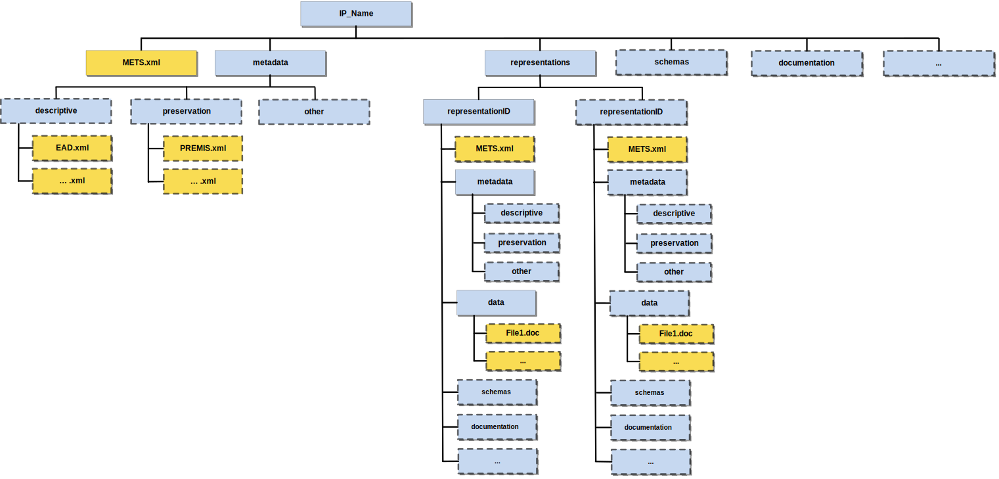

# Introduction

## Definition of a DIP

The OAIS reference model defines a DIP as:

> An Information Package, derived from one or more AIPs, and sent by Archives to the Consumer in response to a request to the OAIS.


The definition of an E-ARK DIP is that it corresponds to a CSIP which is ready to be processed by its designated Access Software; if it is not suited for processing and rendering by its designated Access Software, it is not (yet) a DIP.
This is a very generic, but handy, definition. To be more specific, an E-ARK DIP is:

- an IP which is sent (or is ready to be sent) to the user in an Access environment;
- supported by tools, i.e. can be rendered by Access Software.

First of all, the DIP looks like the AIP: It replicates the structure of the AIP from which it is derived. It also inherits metadata as well as the intellectual entities of the AIP.
An E-ARK AIP may in its entirety therefore also be a E-ARK DIP, however in most cases it is necessary to convert from an AIP to a DIP.  The DIP allows for example for the inclusion of new DIP representation formats, which are more user-friendly than the AIP formats that are intended for long-term preservation purposes.
It also allows for the updating of the metadata as well as for the addition of new metadata elements.  Representation Information, which is required for rendering and understanding the intellectual content, might also be added, and as a direct consequence, there may be a need for new folders and files, for example within the ‘Documentation’ folder.

# Structure
The folder structure of an E-ARK DIP must comply with the requirements for the folder structure for a CSIP, see [Folder structure of the CSIP](http://earkcsip.dilcis.eu/#41-folder-structure-of-the-csip).

The CSIP folder structure and its requirements is visualised in the figure below:



- Blue boxes represent folders
- Yellow boxes represent files.
- Boxes with full lines represent mandatory files/folders
- Boxes with dotted lines represent optional files/folders.

As can be seen from the figure - the requirements for the folder structure for a CSIP is at a bare minimum and makes it possible to have several extra optional folders and files in a CSIP (see boxes with dotted lines).
The first thing to be said about the E-ARK DIP structure in regard to CSIP structure is that an E-ARK DIP will always consist of some of those files and folders that are optional in the CSIP minimum structure.
There must be data to disseminate. Since the definition of an E-ARK DIP is that it corresponds to a CSIP which is ready to be processed by its designated Access Software, this leaves the question as to which data
in the CSIP should be chosen to be encompassed in the E-ARK DIP.

It is possible that an AIP in its current state and in its entirety can be delivered to a Consumer as is and still be considered an E-ARK DIP.
That E-ARK DIP can contain the submission representation, and one or more preservation representations. Often, however, the OAIS is interested in leaving out irrelevant data and metadata and only present the
Consumer with the data and metadata that the Consumer is interested in. This could be isolated to the content in one single representation in an E-ARK AIP, or maybe only a portion of a single representation in an E-ARK AIP. Maybe even only one specific file. The point here is that a plethora of different E-ARK DIPs can be created out of an E-ARK AIP or several E-ARK AIPs.

# Content Information Types

Content Information is *“A set of information that is the original target of preservation or
that includes part or all of that information. It is an Information Object composed of its Content
Data Object and its Representation Information*” according to the OAIS Reference Model.

A Content Information Type can therefore be understood as a category of Content Information, for example
relational databases, scientific data, electronic records management systems, digitised maps, etc..

According to the Common Specification for Information Package it is possible to [create specifications for
Content Information Types](http://earkcsip.dilcis.eu/#61-content-information-type-specifications). It is within these specifications that requirements and descriptions related to the specific Content Information Type is described. The DIP specification can not describe how each Content Information Type should be disseminated and therefore the DIP specification sets out requirements on how Content Information Type specifications should handle DIP requirements.

- A Content Information Type specification should have a section which sole focus is on describing DIP requirements and/or recommendations
  -  The DIP section should describe how to read/edit access rights
  -  The DIP section should describe how to register access software
  -  The DIP section could mention and list relevant access software for the Content Information Type


# Metadata
The DIP metadata is based upon the existing CSIP, E-ARK SIP and E-ARK AIP specifications.
The metadata descriptions provided in this document cover the three core metadata categories:

- structural   (see METS)
- preservation (see PREMIS)
- descriptive  (see EAD)

It must be stated that the CSIP allows for and makes a distinction between preservation metadata and descriptive metadata (or Descriptive Information according to OAIS).
One of the challenges when dividing metadata between preservation metadata and descriptive metadata is that the current metadata standards do not operate with the same distinction. Access rights information can for example both be stored in EAD (descriptive metadata) and in PREMIS (preservation metadata) or in METS.
This leaves the question - where should this access and dissemination information be registered? This E-ARK DIP specification describes two ways of using EAD and PREMIS for registering Access Rights and Access Software. These are possible ways and not yet recommendations.


## METS

METS (Metadata Encoding and Transmission Standard) is a standard for encoding descriptive, administrative, and structural metadata expressed using the XML Schema Language.
The use of METS is mandatory if it must comply with CSIP. See CSIP for the general use of METS in information packages.

The differences between a METS instance for an E-ARK DIP vs an E-ARK AIP are small. Actually, most of the metadata differences between an AIP and a DIP are in the descriptive metadata or preservation metadata such as EAD and PREMIS.

The E-ARK DIP specification is limited to include one and only one representation from an AIP (for which many may exist).
This limitation is made to reduce the complexity of the DIP. Future, more complex E-ARK DIP specifications awaits implementations and experiences from this current specification.
The chosen representation is itself an E-ARK IP and therefore follows the same structure. This is reflected in the IP being migrated from an AIP to a DIP. Below is a broad overview of the METS file.


|          |  Elements    |           |           | Values                     |Comments              |
|----------|--------------| ----------|-----------|----------------------------|----------------------|
| **mets** |              |           |           |                            |                      |
|          | **metsHdr**  |           |           |                            |                      |
|          |              | **agent** |           |                            |software or archivist creating the DIP |
|          | **dmdSec**   |           |           |                            |                           |
|          |              | **mdRef** |           | *EAD*                       |information about descriptive metadata files (e.g EAD) |
|          | **amdSec**  |           |           |                            |                           |
|          |             | **mdRef**  |           | *PREMIS*                    |information about preservation metadata files (e.g PREMIS) |
|          | **fileSec** |           |           |                            |                           |
|          |             | **fileGrp** |           | *Common Specification root* |                           |
|          |             |           | **fileGrp** | *metadata*                  |                           |
|          |             |           | **fileGrp** | *representations*           | normally only one repr. in the DIP |
|          |             |           | **fileGrp** | *schemas*                   |                           |
|          |             |           | **fileGrp** | *documentation*             |                           |
|          | **structMap** |           |           |                            |                           |
|          |             | **div**   |           | *metadata*                  |                           |
|          |             | **div**   |           | *representations*           | mets pointer to mets file for the repr. |
|          |             | **div**   |           | *schemas*                   |                           |
|          |             | **div**   |           | *documentation*             |                           |

In the following the major differences between an XML instance for METS for an E-ARK DIP vs an E-ARK AIP are listed.

**Node level: mets root**

!INCLUDE "implementation/metadata/mets/mets-root/requirements.md"

!INCLUDE "implementation/metadata/mets/mets-root/examples.md"


**Node level: metsHdr**

!INCLUDE "implementation/metadata/mets/metshdr/requirements.md"

!INCLUDE "implementation/metadata/mets/metshdr/examples.md"


**Node level: dmdSec**

!INCLUDE "implementation/metadata/mets/dmdsec/requirements.md"

!INCLUDE "implementation/metadata/mets/dmdsec/examples.md"

**Node level: admSec**


!INCLUDE "implementation/metadata/mets/amdsec/requirements.md"

**Node level: fileSec**

!INCLUDE "implementation/metadata/mets/filesec/requirements.md"

**Node level: structMap**

!INCLUDE "implementation/metadata/mets/structmap/requirements.md"

## PREMIS
PREMIS (Preservation Metadata: Implementation Strategies) is a standard that mainly caters for long-term preservation and technical usability, which for example is used to facilitate a range of preservation strategies including migration and emulation.
From an Access perspective, PREMIS especially satisfies the requirements pertaining to the recording of Representation Information. It is practical to state in a formalised and consistent way how the Access Software should behave and where it should look when dealing with different pieces of information, such as which representation formats are included in the DIP.

### Metadata regarding Representations and Access Software
In PREMIS, a representation is a "set of files, including structural metadata, needed for a complete and reasonable rendition of an Intellectual Entity." See  [PREMIS Editorial Committee (2015). "PREMIS Data Dictionary for Preservation Metadata", p.8](http://www.loc.gov/standards/premis/v3/premis-3-0-final.pdf).

One of the core concepts in PREMIS is the above formulated definition of a representation, but it is also important to note that the CSIP structure also incorporates physical management of different representations. When implementing PREMIS in CSIPs one must therefore choose if there must exist PREMIS files at representation level or at root level only (see CSIP) and one must also choose how fine-grained each description should be.

To enable rendition, three pieces of information are needed in PREMIS: One identifying the representation to be rendered; one identifying the software to enable this; and one establishing a relationship between the two.

The descriptions below therefore show how to:
1.  Describe which DIP representation format is contained in the DIP (description 1 below);
2.  Describe which piece(s) of Access Software is/are needed to render a specific DIP representation format. Several pieces of software may indeed be needed (description 2 below);
3.  Describe the relationship between the DIP representation format and its Access Software (description 3 below).

#### Description 1 - The description of DIP representation formats
In order to describe the specific DIP representation format the semantic component "1.4 significantProperties" is used. An example is:
```xml
<object xsi:type="representation">
   <objectIdentifier>
      <objectIdentifierType>filepath\</objectIdentifierType>
         <objectIdentifierValue>xlink:href=\"representations\\AVID.SA.18006.rep0\"\</objectIdentifierValue>
   </objectIdentifier>
   <significantProperties>
      <significantPropertiesType>DIP representation format\</significantPropertiesType>
         <significantPropertiesValue>SIARD2\</significantPropertiesValue>
   </significantProperties>
<!-- PREMIS file continues but further elements left out in this example-->
</object>
```
Note that the object type is "representation" and that the objectIdentifierType value is "filepath", which according to the AIP specification is an IP scope value. The objectIdentifierValue is the file path to the representation folder or could be a file path to a file.

#### Description 2 - The description of Access Software
In PREMIS 3.0 a description of an environment has become an object itself, so that both non-environmental objects and environmental objects exist. Access Software is therefore an environmental object which per default is an intellectual entity.
The semantic unit "1.9 environmentFunction" is conceived to describe the environment object(s) with different levels of granularity. It is suggested to use [the vocabulary from Library of Congress](http://id.loc.gov/vocabulary/preservation/environmentFunctionType.html).
The semantic unit "1.10 environmentDesignation" is used for information identifying the environment by using human-readable language which can be expected to be understood outside of a digital repository.

See the example which follows this vocabulary:


```xml
<object xsi:type="intellectualEntity">
     <objectIdentifier>
         <objectIdentifierType>local</objectIdentifierType>
         <objectIdentifierValue>DBVTK</objectIdentifierValue>
     </objectIdentifier>
     <environmentFunction>
         <environmentFunctionType>software</environmentFunctionType>
         <environmentFunctionLevel>1</environmentFunctionLevel>
     </environmentFunction>
     <environmentFunction>
         <environmentFunctionType>software application</environmentFunctionType>
         <environmentFunctionLevel>2</environmentFunctionLevel>
     </environmentFunction>
    <environmentDesignation>
	<environmentName>Database Visualization Toolkit</environmentName>
	<environmentVersion>2.4.1</environmentVersion>
	<environmentDesignationNote>Lightweight web viewer for relational databases, specially if preserved in SIARD 2, that uses SOLR as a back-end, and allows browsing, search, and export. Documentation at github.com/eark-project/software/DBVTK</environmentDesignationNote>
	</environmentDesignation>
</object>
```

#### Description 3 - The description of the relation between the representations and the Access Software

In order to establish a connection between the DIP representation format to be rendered and the Access Software to render it, it is necessary to use the semantic unit "1.13 relationship". The relationship element can bind both non-environmental objects together with environmental objects and it can bind environmental objects together with other environmental objects. The following example shows how the DIP representation format can be related to the Access Software:


```xml
<object xsi:type="representation">
   <objectIdentifier>
      <objectIdentifierType>filepath</objectIdentifierType>
      <objectIdentifierValue>xlink:href="representations\AVID.SA.18006.rep0"</objectIdentifierValue>
   </objectIdentifier>
   <significantProperties>
      <significantPropertiesType>DIP representation format</significantPropertiesType>
      <significantPropertiesValue>SIARD2</significantPropertiesValue>
   </significantProperties>
   <!-- The following is the relation between the software and the DIP representation -->
   <relationship>
       <relationshipType>dependency</relationshipType>
       <relationshipSubType>requires</relationshipSubType>
       <relatedObjectIdentifier>
           <relatedObjectIdentifierType>local</relatedObjectIdentifierType>
           <relatedObjectIdentifierValue>DBVTK</relatedObjectIdentifierValue>
         </relatedObjectIdentifier>
       <relatedEnvironmentPurpose>render</relatedEnvironmentPurpose>
   </relationship>
</object>
```

As can be seen above the nature of the relationship, \<relationshipType\> is used (value, e.g. 'dependency'); intimately linked to this is also the indication of a \<relationshipSubType\>, e.g. 'requires'.

In order to identify the Access Software, which is used to render the representation, the \<relatedObjectIdentifier\> is employed; and the \<relatedEnvironmentPurpose\> gives us a hint about what the purpose is (here: to 'render').

Since it is not always possible to render the DIP representation formats with one piece of Access Software, it can be necessary to model software dependencies and sequences between several pieces of software in PREMIS.

## Descriptive metadata - e.g. EAD

Descriptive metadata are used to describe the intellectual contents of archival holdings, and they support finding and understanding individual information packages. The E-ARK DIP allows for the inclusion of any kind of descriptive metadata.
The E-ARK project reached the conclusion that EAD was one of the most used. See the full report
[D3.1 E-ARK Report on Available Best Practices](http://www.eark-project.com/resources/project-deliverables/6-d31-e-ark-report-on-available-best-practices). A common E-ARK EAD guideline is yet to be developed. But for information purposes and since the previous DIP specification described a way to register Access Rights Information the text is given here:

### Access restrictions
OAIS states:
> Access Rights Information: The information that identifies the access restrictions pertaining
> to the Content Information, including the legal framework, licensing terms, and access control.
> It contains the access and distribution conditions stated within the Submission Agreement,
> related to both preservation (by the OAIS) and final usage (by the Consumer).
> It also includes the specifications for the application of rights enforcement measures.

The E-ARK DIP specification does not require that access rights are stored in a specific way since different metadata standards
can be applied differently to different Content Information Types. See Content Information Types.
Since it is possible to have different metadata information in the metadata folder it is recommended to systematically control where access rights metadata are stored. For example access rights metadata can be stored in both EAD and in PREMIS.

The \<accessrestrict> tag is "An element for information about conditions that affect the availability of the materials being described." See [EAD3](<http://www.loc.gov/ead/EAD3taglib/EAD3.html#elem-accessrestrict>).
The Access Rights Information that concerns the end-user has to be available in EAD - not in PREMIS - and \<accessrestrict> is used for this purpose. The reasons being:
It should be possible to find the Access Rights Information in one place and one place only, namely in the descriptive metadata, which, per default, are the metadata displayed in the Access Software (Finding Aids and different viewers). EAD supports the description of potentially very complex hierarchical levels of an IP and can therefore if necessary differentiate access restrictions all the way down to the individual file level. Descriptive metadata are very often added upon Ingest and Finding Aids can thus immediately be populated with this kind of information.
The \<p> tag in \<accessrestrict> is repeatable and can be used in the following way:

**EAD example of \<accessrestrict>**
```xml
<accessrestrict>
 <p>Restricted</p>
 <p>75</p>
 <p>...</p>
</accessrestrict>
```
If the value of the first \<p> is "Restricted" or "" (empty - which also means that it is restricted) the tool will look for a second \<p> which specifies the restriction period. "Unrestricted" means that the IP is immediately accessible. The second \<p> can contain any text, for example \<p>This IP is available 20 years from November 14 2002\</p>.
Note that the EAD3 schema validates even without the \<head> tag inside \<accessrestrict>.
For more complex scenarios, it is possible to use \<chronlist> as follows:

EAD example of \<chronlist>
```xml
<accessrestrict>
 <chronlist>
  <chronitem>
   <daterange>
    <fromdate>01.01.2016</fromdate>
    <todate>01.01.2041</todate>
   </daterange>
   <event>
    <list>
     <item>type of the restriction (e.g. personal data)</item>
     <item>duration of the restriction in years (e.g. 25 years)</item>
     <item>source of the restriction (e.g. Public access law AvTS 7)</item>
     <item>additional description of the access restriction (e.g. The content can be made public if personal data is removed from the DIP)</item>
    </list>
   </event>
  </chronitem>
 </chronlist>
</accessrestrict>
```
# Appendices

## Appendix A: E-ARK Information Package METS example

!INCLUDE "appendices/examples/examples.md"

## Appendix B: External Schema

!INCLUDE "appendices/schema/schema.md"

## Appendix C: External Vocabularies

!INCLUDE "appendices/vocabs/vocabs.md"

## Appendix D: A Full List of E-ARK DIP Requirements

!INCLUDE "appendices/requirements/requirements.md"

# Bibliography
Bredenberg, Karin, Björn Skog, Anders Bo Nielsen, Kathrine Hougaard Edsen Johansen, Alex Thirifays,
Sven Schlarb, Andrew Wilson, et al. 2018. Common Specification for Information Packages (Csip). ERCIM
News. 2.0.0-DRAFT ed. Digital Information LifeCycle Interoperability Standard Board (DILCIS Board).
[http://earkcsip.dilcis.eu/](http://earkcsip.dilcis.eu/)

OAIS. 2012. Reference Model for an Open Archival Information System. CCSDS 650.0-M-2 (Magenta
Book). CCSDS - Consultative Committee for Space Data Systems.
[http://public.ccsds.org/publications/archive/650x0b1.pdf](http://public.ccsds.org/publications/archive/650x0b1.pdf).

PREMIS. 2017. PREMIS Data Dictionary for Preservation Metadata, Version 3.0. The Library of Congress.
[https://www.loc.gov/standards/premis/v3/index.html](https://www.loc.gov/standards/premis/v3/index.html).
